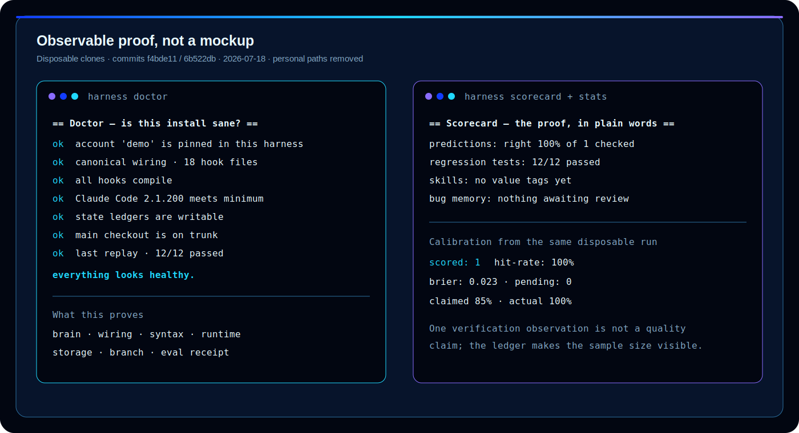
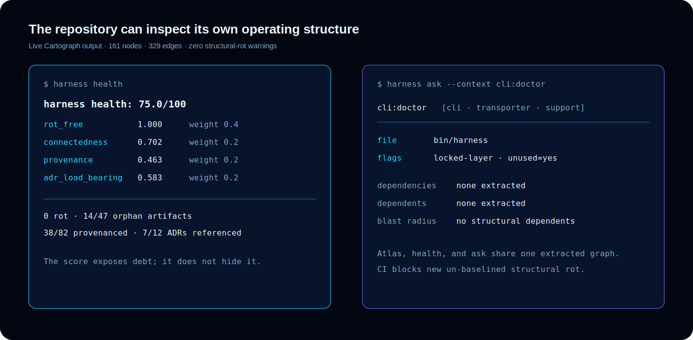
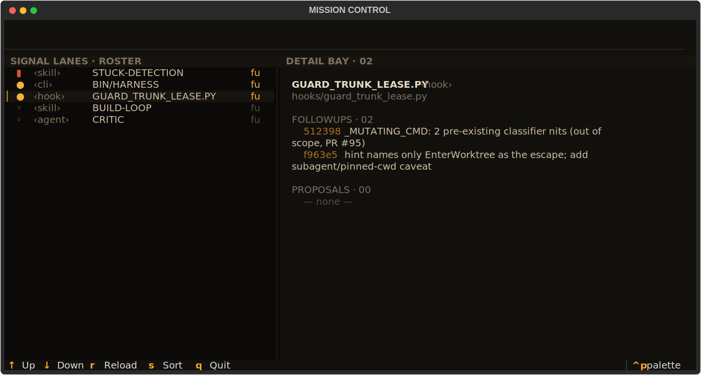
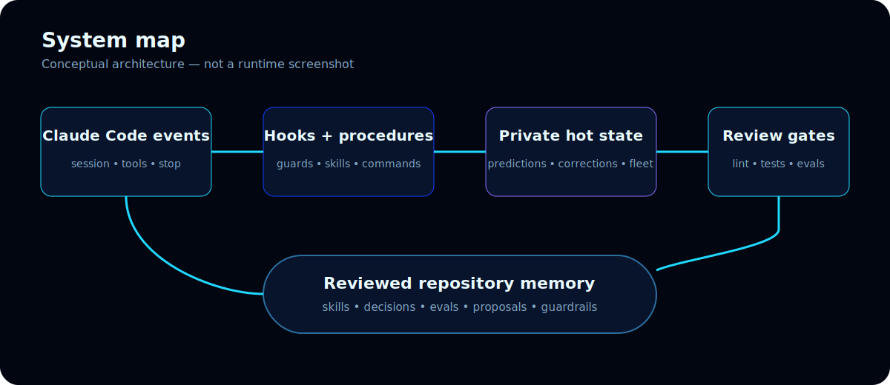
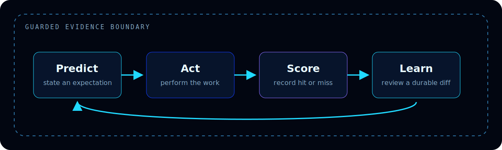

<p align="center">
  
</p>

<h1 align="center">Recursive Harness</h1>

<p align="center"><strong>Durable state. Observable agents. Evidence-backed improvement.</strong></p>

<p align="center">A local-first control plane that turns coding-agent work into scored outcomes, safety gates, and reviewed repository memory.</p>

<p align="center">
  <a href="https://github.com/GhostlyGawd/recursive-harness/actions/workflows/ci.yml"></a>
  <a href="https://github.com/GhostlyGawd/recursive-harness/releases/latest"></a>
  <a href="LICENSE"></a>
  
</p>


<p align="center">
  <a href="https://github.com/GhostlyGawd/recursive-harness/releases/latest"><strong>Download the release</strong></a>
  &nbsp;·&nbsp; <a href="#install-in-five-minutes">Install from source</a>
  &nbsp;·&nbsp; <a href="docs/getting-started.md">Read the guide</a>
  &nbsp;·&nbsp; <a href="docs/architecture.md">Explore the architecture</a>
</p>

Recursive Harness does not retrain the model. It makes the environment around the model
measurable: predictions are scored, corrections stay visible, concurrent work is guarded,
and accepted lessons become reviewed skills, commands, decisions, evaluations, or policy.
The result is an improvement loop you can inspect instead of a growing prompt file you have
to trust on faith.

The public adoption default is now non-invasive: inspect first, keep every existing
`AGENTS.md`, `CLAUDE.md`, agent, skill, hook, and provider setting authoritative, then opt
into only the capabilities you want. The canonical capability model is provider-neutral,
but the full production integration today is the advanced Claude Code reference runtime.
Observe, Learn, and Verify now ship as generated-beta Claude, generic Agent Skill, and local
Codex packages.
Recursive also includes an experimental, narrow OpenAI/Codex
[Specialization adapter](docs/codex-specialization.md); it packages that canonical capability
rather than making the entire harness installable. The separately trusted, no-op-by-default
[Recursive Guard](docs/guard-plugin.md) is also available as a separate Codex beta. Coordinate
and Lab remain planned. See the [Observe guide](docs/observe-plugin.md),
[Learn guide](docs/learn-plugin.md), [Verify guide](docs/verify-plugin.md),
[capability catalog](capabilities/README.md), [architecture](docs/architecture.md), and
[Agentic Dev OS consolidation map](docs/comparisons/agentic-dev-os.md) for the boundary and
migration status.

## What you get

| Capability | What ships |
| --- | --- |
| Evidence loop | Falsifiable predictions, hit/miss outcomes, confidence calibration, Brier score, and one-screen Scorecard |
| Learning ledgers | Corrections, skill value, follow-ups, durable retro completion, retention-aware GC, and reviewed retrospectives |
| Work safety | Worktree ownership, concurrent-session isolation, trunk leases, branch-first guards, pre-merge checks, and explicit human approval gates |
| Operator controls | Doctor diagnostics, feature flags, privacy audit/scrub, plain-language explanations, and copy-pasteable recovery guidance |
| Structural intelligence | Cartograph graph extraction, generated Atlas and Pulse, health/rot gates, dependency paths, and read-only structural questions |
| Governed change | Proposal lifecycle states, validated transitions, generated indexing, acceptance criteria, decision history, and locked-layer review rules |
| Agent coordination | Fleet/Agent Mail claims, handoffs, inboxes, acknowledgements, TTL cleanup, and one canonical event log across worktrees |
| Control room | Optional Mission Control TUI with roster, map, proof counters, contention signals, and a read-only live feed |
| Project integration | Zero-write compatibility inspection, personal sidecar operation, an advanced Claude account silo, shared session-store migration, and pinned multi-repository worktree sources |

## See the product, not just the concept

The following captures are sanitized output from the tested repository. They are not
illustrative metrics. The capture commit and fixture provenance live in
[brand/evidence](brand/evidence/README.md).



Doctor identifies the loaded account, verifies canonical hook wiring, compiles hooks,
checks the Claude Code minimum, and pairs every failure with a repair command. Scorecard and
calibration expose sample size so a single observation cannot masquerade as mature evidence.



Cartograph turns the repository into a queryable graph. `health`, `map`, and `ask` surface
structure, dependencies, proposals, and rot without letting the score replace review.



Mission Control is an optional, read-only Textual interface over the same Cartograph and
Fleet data. This capture is a real render of the repository's tested sample fixture.

## How it works

In the full Claude reference runtime, lifecycle events enter through Recursive-owned account
settings. Hooks enforce narrow safety rules and record selected local signals; skills,
commands, and fresh-context agents perform the reasoning; lint, tests, eval structure, and
Cartograph protect the resulting change. Personal-sidecar use calls the same explicit CLI
without replacing a project's provider configuration. Private operational state stays in
the Recursive checkout until a human promotes a sanitized lesson through review.





| Loop | Cadence | Durable result |
| --- | --- | --- |
| Task | Every meaningful task | Falsifiable prediction plus a scored outcome |
| Session | `/retro` | Corrections and failures routed into a reviewed change |
| Portfolio | `/meta-retro` | Calibration, pruning, eval coverage, and bounded-autonomy proposals |

## Three operator journeys

### 1. Prove a fresh install

Create an isolated account, pin it for the session, and let Doctor verify the wiring rather
than assuming the correct Claude configuration loaded.

```bash
./install.sh
./account-init.sh dev --store-account dev
CLAUDE_CONFIG_DIR="$PWD/.claude-private/accounts/dev" python3 bin/harness doctor
./launch.sh dev
```

### 2. Turn a result into reviewed memory

```bash
python3 bin/harness predict \
  --task "harden the parser" \
  --expect "the malformed fixture is rejected and the full suite stays green" \
  --confidence 0.75

# Do the work, verify the observable result, then score it.
python3 bin/harness outcome PREDICTION_ID --result hit --notes "fixture and suite passed"
python3 bin/harness stats
python3 bin/harness scorecard
```

Run `/retro` after significant or correction-born work. It reviews prediction debt,
corrections, failures, and skill outcomes, then routes a durable lesson through the normal
pull-request and evaluation path. `/calibrate`, `/gc`, and `/meta-retro` close the longer
feedback loops.

### 3. Coordinate parallel or multi-repository work

```bash
# Inspect another project without reading configuration contents or changing any file.
python3 /path/to/recursive-harness/scripts/recursive_inspect.py /path/to/project

# Share claims and handoffs through the canonical worktree-aware event log.
python3 /path/to/recursive-harness/bin/harness fleet emit claim \
  --target src/auth.py --note "refactoring login"
python3 /path/to/recursive-harness/bin/harness fleet claims
python3 /path/to/recursive-harness/bin/harness fleet send reviewer \
  --re fix/login --msg "ready for review"
```

Session guards detect cross-worktree ownership conflicts, while configured companion
repositories use reviewed immutable commits unless explicitly marked as development-only.

## Choose an adoption mode

| Mode | Changes the project? | Use it when |
| --- | --- | --- |
| Compatibility inspection | No | You want a deterministic inventory of existing agent configuration before deciding anything |
| Personal sidecar | No | You want explicit prediction, outcome, privacy, structure, or coordination commands while keeping the project's setup untouched |
| Namespaced capability plugin | Observe, Learn, and Verify: Claude, generic, and local Codex beta; Guard: separate local Codex beta; Specialization: narrow Codex preview; others planned | You want one capability without adopting the full runtime or replacing provider configuration |
| Reviewed repository integration | Exact proposed diff only | A team deliberately wants shared workflow or CI configuration in the repository |
| Full Claude reference runtime | No target-source writes, but it selects a separate Claude configuration | You want the complete hooks, agents, skills, settings, and safety model and accept isolation from your normal Claude config |

Inspection is read-only and does not print file contents:

```bash
python3 scripts/recursive_inspect.py /path/to/existing-project
# Compatibility notes are reported; Repository writes: none
```

The retained `project-init.sh` command is now only a deprecated compatibility wrapper for
that inspector. It never appends to `CLAUDE.md`. There is intentionally no automatic
“merge both configurations” command: precedence and hook conflicts require a human-owned,
reviewed integration.

### Install only Recursive Observe

Observe is hook-free and keeps its private state outside the active repository.

```bash
# Codex: repository catalog at the tested immutable revision (not the public marketplace).
codex plugin marketplace add GhostlyGawd/recursive-harness --ref 202647e50edea2418773e8005e93630a5b7ca479
codex plugin add recursive-observe@recursive-harness

# Claude Code: personal/user scope; does not edit the project.
claude plugin marketplace add GhostlyGawd/recursive-harness
claude plugin install recursive-observe@recursive-harness --scope user
```

The self-contained package is generated from one canonical skill plus the shared private-state
helper and carries a SHA-256 source receipt.
See [Recursive Observe](docs/observe-plugin.md) for generic-skill installation, privacy,
uninstall, and the honest hosted-web compatibility limits.

### Install only Recursive Learn

Learn is hook-free. It stores sanitized corrections, follow-ups, and candidates in the user's
private sidecar and can print—but never apply—a proposed learning diff.

```bash
# Codex: personal plugin cache; the active repository is not changed.
codex plugin add recursive-learn@recursive-harness

# Claude Code: user scope; the active repository is not changed.
claude plugin install recursive-learn@recursive-harness --scope user
```

The catalog-add command is the same as Observe above. See [Recursive Learn](docs/learn-plugin.md)
for the generic Agent Skill copy, exact privacy boundary, real-consumer evidence, and unsupported
hosted-web cases.

### Install only Recursive Verify

Verify is hook-free and stateless. It produces content-free structural scorecards, fixed
Atlas-style queries, non-executing eval-corpus inspection, and exact proposal diffs without an
apply operation.

```bash
# Codex: personal plugin cache; the active repository is not changed.
codex plugin add recursive-verify@recursive-harness

# Claude Code: user scope; the active repository is not changed.
claude plugin install recursive-verify@recursive-harness --scope user
```

The catalog-add command is the same as Observe above. Verify never runs repository graders,
tests, hooks, commands, binaries, or model prompts. See [Recursive Verify](docs/verify-plugin.md)
for generic Agent Skill installation, real-consumer evidence, and the exact security boundary.

### Add enforcement only through a separate trust decision

Recursive Guard is a distinct Codex plugin, never a dependency of Observe or
Specialization. Installing it changes no repository and produces no hook output until a
repository owner reviews and commits `.recursive-guard.json`. Start with `audit`; use
`enforce` only after testing one allowed and one protected operation.

```bash
# Add the same repository catalog, then install Guard as a separate trust decision.
codex plugin marketplace add GhostlyGawd/recursive-harness --ref 202647e50edea2418773e8005e93630a5b7ca479
codex plugin add recursive-guard@recursive-harness
```

Review the exact hook in `/hooks` before trusting it. Guard covers supported local Bash and
`apply_patch` paths; it is not a sandbox and does not replace GitHub permissions or CI. See
[Recursive Guard](docs/guard-plugin.md) for the policy, coexistence proof, and removal path.

## Install in five minutes

This section installs the full Claude reference runtime in its own explicit account silo.
For a first look at an existing project, run the zero-write inspector above; installation is
not required.

Supported baseline: Python 3.12, Git 2.39.0 or newer, Bash 5.x (current Git Bash on
Windows), and Claude Code 2.1.200 or newer. Ubuntu, Windows, and macOS operator journeys
run continuously in CI. See the [compatibility matrix](docs/compatibility.md) for the exact
contract and optional dependencies.

### Versioned release bundle

The GitHub Release is the supported versioned distribution channel. It contains
deterministic `.tar.gz` and `.zip` source bundles, an embedded file manifest, and a SHA-256
sidecar covering both archives.

```bash
gh release download v0.1.2 -R GhostlyGawd/recursive-harness \
  -p "recursive-harness-v0.1.2.tar.gz" \
  -p "recursive-harness-v0.1.2.zip" \
  -p "recursive-harness-v0.1.2.sha256"
sha256sum -c recursive-harness-v0.1.2.sha256
tar -xzf recursive-harness-v0.1.2.tar.gz
cd recursive-harness-v0.1.2
./install.sh
```

The sidecar covers both archives, so keep both beside it during verification. On macOS use
`shasum -a 256 -c recursive-harness-v0.1.2.sha256`; on Windows compare each result from
`Get-FileHash -Algorithm SHA256` with its sidecar line. Use Git Bash for the shell installer
and enable Windows Developer Mode so account links are native symlinks.

### Latest source

```bash
git clone https://github.com/GhostlyGawd/recursive-harness.git
cd recursive-harness
./install.sh
./account-init.sh dev --store-account dev
CLAUDE_CONFIG_DIR="$PWD/.claude-private/accounts/dev" python3 bin/harness doctor
```

Installation changes nothing globally by default and preserves an existing Git
`post-merge` hook through a managed dispatcher. Non-destructive removal is supported with
`./uninstall.sh --account dev` or `.\uninstall.ps1 -Account dev`; settings, transcripts,
backups, ignored state, and the checkout are retained for deliberate inspection. Follow
[Getting started](docs/getting-started.md) for upgrades, rollback, and recovery.

## Core, optional, and experimental

| Level | Surfaces | Expectation |
| --- | --- | --- |
| Supported beta | Read-only inspection; personal sidecar CLI; full Claude install/account flow; hooks and review gates; Cartograph; proposal governance | Continuously tested on the supported baseline; breaking changes remain possible before 1.0 and require aligned docs/evidence |
| Optional | Fleet MCP adapter and Mission Control TUI | Tested separately with pinned dependency snapshots; not required for the core loop |
| Generated beta | Recursive Observe, Recursive Learn, and Recursive Verify for Claude, generic Agent Skills, and local Codex | Generated artifacts, source receipts, standalone runtimes, coexistence fixtures, and real isolated consumer installs pass; hosted use remains unverified |
| Generated beta | Recursive Guard for local Codex | Separately installed and trusted; inert without a reviewed repository policy; receipt-bound, coexistence-tested, and consumer-installed, but not a sandbox |
| Planned | Coordinate and Lab provider packages | Capability manifests exist; provider packages and broad compatibility claims require generated artifacts and consumer evidence |
| Experimental | Product/venture workflows, extraction proposals, and product-build tooling | Available for evaluation without a compatibility promise |
| Internal/legacy | Raw state schemas, graph internals, calibration storage, and `--global-legacy` install | Not a public integration surface; legacy install is a guarded migration path only |

The complete promise and promotion criteria are in
[Product surface and stability](docs/product-surface.md).

## Why not plain `CLAUDE.md`?

| Plain instruction file | Recursive Harness |
| --- | --- |
| Describes desired behavior | Records whether the expected behavior actually happened |
| Relies on one context window | Shares hot local ledgers and reviewed cold memory across sessions and worktrees |
| Has no native calibration | Scores confidence, misses, prediction debt, and sample size |
| Cannot coordinate concurrent writers | Adds ownership, lease, claim, and handoff protocols |
| Grows through prose edits | Routes learnings to the smallest appropriate skill, command, decision, eval, or guard |
| Offers no structural proof | Runs lint, tests, eval structure, Doctor, Scorecard, Cartograph, and protected GitHub checks |

Your existing instruction files remain yours. Recursive neither appends its policy nor
assumes its instructions outrank them. The improvement loop belongs in a sidecar or selected
namespaced capability; repository-specific truth stays in the repository's established
instruction hierarchy.

## Verification and proof points

- Protected `main` requires the branch to be current and requires Linux, Windows, macOS,
  minimum-Git, optional-surface, Python CodeQL, and Actions CodeQL checks.
- Black-box disposable-clone tests cover install → account initialization → Doctor →
  byte-identical coexistence inspection → predict/outcome/Scorecard → settings backup →
  uninstall/rollback.
- The release builder produces byte-identical archives from one committed revision and
  publishes a manifest plus SHA-256 checksums.
- Secret scanning, push protection, private vulnerability reporting, Dependabot, immutable
  Actions pins, privacy redaction/retention, and alert-by-alert CodeQL triage are enabled.
- The core CLI, hooks, Cartograph, eval runner, and Fleet engine use Python's standard
  library. Optional Mission Control and MCP dependencies are isolated and pinned in CI.

Browse the [Harness Atlas](cartograph/ATLAS.md), [operations guide](docs/operations.md),
[release checklist](docs/releasing.md), or the point-in-time
[Agentic Dev OS comparison](docs/comparisons/agentic-dev-os.md).

## Trust, security, and privacy

Recursive Harness executes trusted hooks and commands with the operator's permissions. It
is not a sandbox and does not make an untrusted skill, repository, MCP server, or shell
command safe. Review executable changes and configured repository sources as code.

Ignored state can contain short prompt or failure excerpts, local paths, session metadata,
and transcripts. Writers redact common secret and PII shapes, use owner-only local-state
primitives where supported, default raw excerpts to 30-day retention, and expose
`harness privacy audit|scrub`. These are defense in depth. Anything promoted into memory,
proposals, fixtures, screenshots, or Git history becomes public.

Read [PRIVACY.md](PRIVACY.md), report vulnerabilities through the private process in
[SECURITY.md](SECURITY.md), and review the latest
[security assessment](docs/security-assessment-2026-07-17.md). Scanner alerts are triage
signals, not proof of exploitability, and remaining reviewed findings are documented rather
than hidden.

## Current limits

- This is an active beta, not a 1.0 compatibility promise or a security sandbox.
- Deterministic CI does not invoke a model API. A real Claude Code
  predict → act → score → retro → reviewed-change replay remains human release evidence.
- Correction and failure capture are heuristic; promotion into public memory remains a
  human-reviewed act.
- GitHub Releases are the supported packaged channel. Homebrew, Scoop, Winget, and other
  package-manager channels are not published yet.
- Host filesystem, symlink, terminal, Claude service, MCP service, and model-provider
  behavior remain outside the repository's test boundary.

Recursive Harness is distributed under the repository-wide [MIT License](LICENSE).
See the [roadmap](docs/roadmap.md) for remaining work and [brand/README.md](brand/README.md)
for the profile-aligned visual system and asset provenance.
