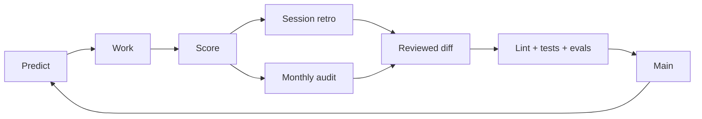

# Recursive Harness

Recursive Harness is a versioned control plane for Claude Code. It turns agent behavior
into reviewable repository changes: predictions are scored, corrections and failures are
captured locally, retrospectives route lessons to the right artifact, and CI checks that
the learning system has not weakened its own evidence.

**Status:** beta · **Version:** 0.1.2 · **Runtime:** interactive Claude Code ·
**CI:** Python standard library, no model invocation

[Get started](docs/getting-started.md) · [Architecture](docs/architecture.md) ·
[Operations](docs/operations.md) · [Security](SECURITY.md) · [Privacy](PRIVACY.md) ·
[Compatibility](docs/compatibility.md) · [Support](SUPPORT.md) ·
[Recommended next steps](docs/roadmap.md)

## Why this exists

Model weights do not change during a coding session. This project makes the surrounding
repository the learning surface instead. A useful lesson becomes a diff with provenance,
tests, review, and a rollback path—not an unreviewed note hidden in a session transcript.

The system is built around four constraints:

- **Learning is versioned.** Durable behavior lives in skills, commands, hooks, decisions,
  evals, or other reviewed artifacts.
- **Claims are scored.** Unscored predictions remain visible debt; unverifiable outcomes
  count as misses.
- **Evidence is protected.** The enforcement layer cannot quietly rewrite the rules that
  measure it.
- **Automation earns scope.** Autonomy is graduated by observed acceptance, while
  enforcement changes always remain human-gated.

## System at a glance



| Loop | Cadence | Output |
| --- | --- | --- |
| Task | Every meaningful task | A falsifiable prediction and a hit/miss outcome |
| Session | At `/retro` | Corrections, misses, and failures routed into a reviewed change |
| Portfolio | At `/meta-retro` | Pruning, calibration review, eval coverage, and autonomy proposals |

Claude Code lifecycle events are wired through `settings.json`. Hooks protect guarded
paths, coordinate worktrees and sessions, log selected local signals, and surface cadence
nudges. The procedure layer—skills, commands, and fresh-context agents—does the reasoning.
The evidence layer—lint, tests, evals, and Cartograph—checks the result.

## Quick start

Prerequisites: Git, Bash, Python 3.12 (the CI version), and Claude Code. Windows users
should use Git Bash with Developer Mode enabled so account links are real symlinks.

```bash
git clone https://github.com/GhostlyGawd/recursive-harness.git
cd recursive-harness

./install.sh                 # installs the repo Git hook; changes nothing globally
./account-init.sh dev        # creates an ignored, per-account config silo

export CLAUDE_CONFIG_DIR="$PWD/.claude-private/accounts/dev"
python3 bin/harness doctor   # verifies wiring and prints exact fixes
claude
```

To use the harness in another repository, keep `CLAUDE_CONFIG_DIR` pinned when launching
Claude Code there. Optionally run `project-init.sh` from that project to append a thin,
project-specific `CLAUDE.md` contract. The detailed Unix and Windows flows are in
[Getting started](docs/getting-started.md).

## What is in the repository

| Area | Responsibility |
| --- | --- |
| `CLAUDE.md`, `memory/decisions/` | Small kernel and architectural decisions |
| `skills/`, `commands/`, `agents/` | Triggered procedures and fresh-context review roles |
| `hooks/`, `settings.json`, `templates/` | Lifecycle wiring, safety gates, and account configuration |
| `bin/harness`, `state/` | Local prediction, correction, follow-up, approval, and coordination ledgers |
| `lint/`, `tests/`, `evals/` | Governance, behavior, and regression evidence |
| `cartograph/` | Extracted topology, structural queries, health, and rot detection |
| `fleet/`, `mission_control/` | Append-only agent coordination and a read-only operator view |
| `proposals/`, `products/` | Reviewed design work and thin portfolio registrations |

For machine-derived topology, use the [Harness Atlas](cartograph/ATLAS.md). For the full
documentation index, see [docs/README.md](docs/README.md).

## Everyday operation

```bash
# Before a non-trivial task
python3 bin/harness predict \
  --task "describe the task" \
  --expect "a falsifiable expected result" \
  --confidence 0.7

# After the result is known
python3 bin/harness outcome PREDICTION_ID --result hit --notes "what happened"

# Inspect the system
python3 bin/harness scorecard
python3 bin/harness health
python3 bin/harness ask --context commands/retro.md
```

Inside Claude Code, `/retro`, `/calibrate`, `/gc`, `/run-evals`, `/atlas`, and
`/meta-retro` operate the larger feedback loops. See [Operations](docs/operations.md) for
cadence, diagnostics, account synchronization, and recovery guidance.

## Trust and data boundary

This repository executes local hooks and shell commands with the operator's permissions;
it is not a sandbox. Treat configured skills, hook changes, MCP integrations, and the
repositories in `worktree-repos.json` as trusted code.

Hot state and account/session data are gitignored, but they can contain short prompt or
failure excerpts, machine paths, and session identifiers. Versioned memory, proposals,
fixtures, and provenance are public once committed. Read [PRIVACY.md](PRIVACY.md) before
using the harness with sensitive work and report vulnerabilities through the private path
in [SECURITY.md](SECURITY.md).

## Current limits

- The harness improves procedures and error avoidance; it does not change model weights.
- Model-backed eval replay happens interactively. CI never invokes Claude Code or an API.
- Correction and failure capture are heuristic and require review before promotion.
- The supported setup is source-based and Bash-oriented; Windows needs Git Bash for the
  setup scripts and PowerShell for the native session-sync helper.
- The repository has no root license yet. `fleet/LICENSE` applies only to the Fleet
  extraction scaffold, not to the repository as a whole.

The [2026-07-17 deep dive](docs/security-assessment-2026-07-17.md) records the latest
security/privacy review, and [the roadmap](docs/roadmap.md) turns the wider architectural
findings into ordered next steps.
