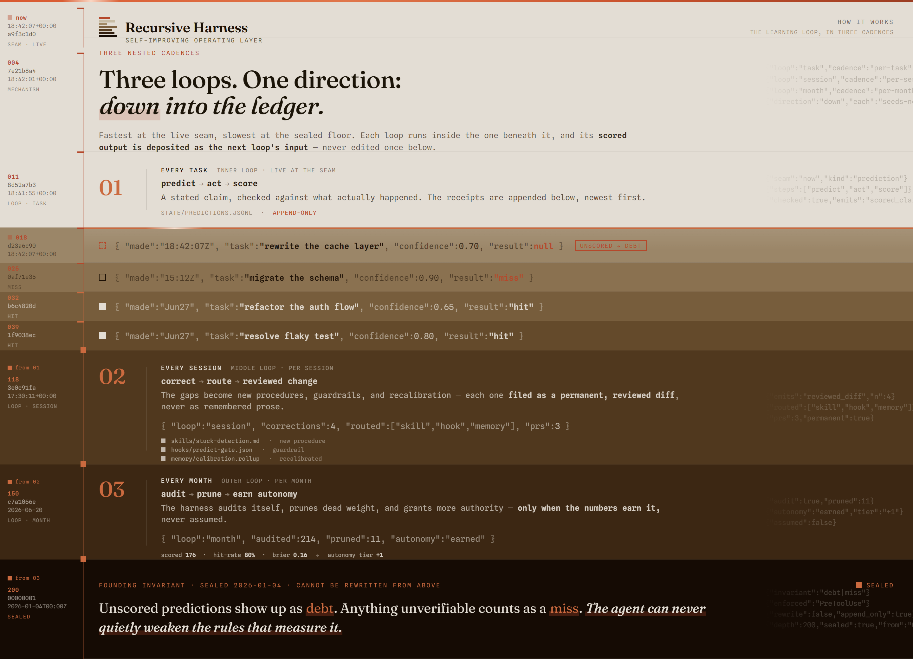
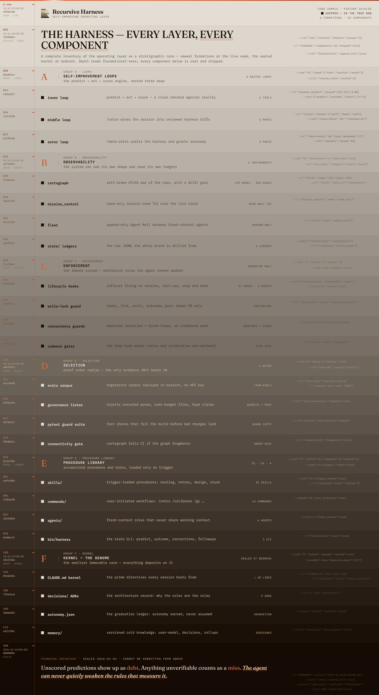

# Recursive Harness

**A self-improving operating layer for an AI coding agent.** The model's weights are
frozen, so the *repository* becomes the only thing that can learn. Every prediction is
scored against reality; every lesson is filed as a permanent, reviewed change. An
unchanging model gets measurably better at your work over time — and shows its scorecard.

> Honest by construction: unscored predictions show up as **debt**, anything unverifiable
> counts as a **miss**, and the agent can never quietly weaken the rules that measure it.

This repo *is* the memory. There is no other memory (ADR 0001). Learning is defined as
committing reviewed diffs here — never as accumulating prose. Everything below follows
from that one definition.

---

## How it works — three loops, one direction: down into the ledger



| Loop | Cadence | What happens |
|---|---|---|
| **Inner** | every task | `predict → act → score`. A falsifiable claim, logged *before* acting, then scored hit/miss. Calibration is a number, not a vibe. |
| **Middle** | every session — `/retro` | Corrections + misses + stuck events are mined, routed to the right artifact (hook / skill / command / agent / memory), linted, adversarially audited, and shipped as a PR. |
| **Outer** | every month — `/meta-retro` | Prune zero-fire skills, fix overridden artifacts, review calibration drift, replay the eval corpus, and graduate autonomy — only where the numbers earn it. |

Each loop's scored output is deposited as the next loop's input. Nothing is overwritten;
the founding invariants sit sealed at the bottom, immovable beneath everything that came after.

---

## What's inside — every layer, every component

The whole system as one core sample: **6 formations · 23 shipped components.** Newest/most-live
at the top, the kernel sealed at bedrock.



- **Self-improvement loops** — the `predict → act → score` engine, nested three deep.
- **Observability** — `cartograph` (a self-drawn [ATLAS](cartograph/ATLAS.md) of the repo, 139 nodes / 303 edges, with a drift gate), `mission_control` (read-only control-room TUI), `fleet` (append-only Agent Mail), and the `state/` JSONL ledgers.
- **Enforcement** — 17 lifecycle hooks across 6 events; the write-lock guard (the layer that measures the agent is human-PR-only); worktree + trunk-lease concurrency guards; the Stop gates that make `/retro` non-optional.
- **Selection** — the regression corpus + `/run-evals` (in-session, no API key); the self-governance linter; a pytest guard suite; the cartograph connectivity gate. The only evidence that vN+1 beats vN.
- **Procedure library** — 21 trigger-loaded skills, 14 commands, 4 fresh-context agents (`critic`, `retro-miner`, `harness-auditor`, `followup-synthesizer`), and the `bin/harness` state CLI.
- **Kernel** (bedrock, sealed) — `CLAUDE.md` (≤60 lines, lint-enforced), 9 ADRs, `autonomy.json`, and versioned `memory/`. The smallest immovable core; everything deposits on it.

---

## Quick start

```bash
git clone <your-fork> recursive-harness && cd recursive-harness

# Fleet / siloed (default): complete a per-account config dir INSIDE the repo.
# The fleet tooling pins CLAUDE_CONFIG_DIR; this fills the dir in (symlinks + generated settings).
./account-init.sh <name>      # or, inside a fleet session: ./account-init.sh
./project-init.sh             # run in a project root for its thin CLAUDE.md contract

# Single-user global (legacy, opt-in): symlink the whole repo to ~/.claude.
./install.sh --global-legacy  # refuses if ~/.claude is a real dir or CLAUDE_CONFIG_DIR is set
```

From then on: work normally. The hooks watch, the kernel routes, `/retro` harvests.

### Add the harness to an existing repo on this machine

Two independent steps — NEITHER is auto-created:

1. **Load the brain (persistent).** In a terminal IN that repo, start Claude with the
   harness config dir pinned:
   `CLAUDE_CONFIG_DIR=<harness>/.claude-private/accounts/<name> claude`. A plain `claude`
   loads the OS-global `~/.claude`, **not** this harness (ADR 0004). Persist the pin —
   every session in the repo needs it.
2. **(Optional) thin project contract.** Run `./project-init.sh` in the repo root to write
   a thin local `CLAUDE.md` (repo-specific facts only, < 40 lines). Skip it when the repo
   needs no project-local facts — the brain still loads from step 1.

> ⚠ A sibling launcher (e.g. a `fable-harness` / `Hybrid` wrapper) pins a *different*
> `CLAUDE_CONFIG_DIR` and loads a *different* brain. If behavior surprises you, check which
> config dir is actually pinned.

---

## How each guarantee is enforced

Not aspirations — mechanisms. Each is a real artifact you can read.

- **Self-improvement without weight updates.** signal → routed artifact → linted diff →
  adversarial audit → PR → (optionally automated) merge → regression evals. Every step
  inspectable, every change reversible. The unit of learning is a diff with a `provenance:`
  line naming the session that earned it; rules without receipts get pruned at `/meta-retro`.

- **Verified self-awareness.** You can't verify a feeling; you can verify a ledger.
  `harness predict --expect "root cause is X; ≤2 files; suite green" --confidence 0.7`
  before acting, scored after. `harness stats` shows claimed confidence vs. actual hit rate
  per bucket, with Brier scores. The critic that grades a deliverable never sees the
  builder's reasoning — judgement is structurally protected from sunk cost.

- **No reward hacking.** The cheapest path to better metrics is weakening the instruments.
  So `hooks/`, `lint/`, `evals/`, `autonomy.json`, `settings.json`, `.github/` are
  write-locked by a PreToolUse guard that exits 2 on any mutating call — unless a human has
  placed a `HUMAN_APPROVED` marker. Three layers deep: prose rule in the kernel, mechanical
  block in the hook, schema check in the lint. `enforcement: graduable=false`, always.

- **Auto-memory is structurally impossible, not just discouraged.** The linter rejects
  user-model bullets without `(evidence: N, last: DATE, source: …)`, artifacts without
  provenance, a kernel over 60 lines, skill descriptions over 600 chars. The cheat doesn't
  fail review — it fails CI. Compression pressure doubles as quality pressure.

- **Autonomy is graduated, not granted.** Every change category starts at zero autonomy
  (all PRs, human-reviewed). At ≥20 proposals with ≥95% acceptance, `/meta-retro` may
  propose flipping a category to auto-merge — itself a human-reviewed change. The measuring
  stick can never auto-modify itself.

- **Trainable intuition.** In-flight, the logged prediction is a tripwire: the moment reality
  diverges from `--expect`, stop and re-plan. Across failures, the `stuck-detection` ladder
  (fix the cause → switch *strategy class* → escalate with falsified hypotheses). Every
  derailment routes somewhere permanent, so its failure is never free twice.

- **One hive mind, many accounts.** Every account and project runs the same brain through
  its own siloed config dir; learnings flow one direction — branch + PR into this repo — so
  there is exactly one trunk. `git clone` + `./account-init.sh <name>` restores the whole mind.

---

## Operating cadence

After significant tasks: `/retro` (the Stop gate insists when you forget). Every ~10
sessions: `/calibrate` then `/gc`. Monthly: `/meta-retro`. After any accepted task that
recurs or was correction-born: `/capture-eval`.

## Repository map

```
CLAUDE.md          kernel (≤60 lines, lint-enforced)      settings.json   hook registration
skills/            21 trigger-loaded procedures           agents/         4 fresh-context roles
commands/          14 named workflows                     hooks/          17 lifecycle enforcers (write-locked)
bin/harness        state ledger CLI                       lint/           self-lint (budgets, falsifiability)
memory/            user-model, ADRs, rollups (versioned)  state/          hot JSONL (gitignored)
evals/             regression corpus + runner             autonomy.json   graduated-autonomy ledger
cartograph/        the self-drawn ATLAS + drift gate      mission_control/ read-only control-room TUI
templates/         portable canonical account settings    account-init.sh per-account config-dir generator
tests/             hook behavior tests                    .github/        CI: pure-Python lint + tests
brand/             the brand: LANGUAGE.md + tokens + dist  .claude-private/ per-account config dirs (gitignored)
```

## Honest limits

This compounds; it does not explode. Model capability is fixed, so what grows is the
elimination of repeated mistakes plus accumulated procedure and taste. The correction
detector is a heuristic (`/retro` filters its noise). **Nothing runs headless** — no
`claude -p`, no Agent SDK, no API key, anywhere (ADRs 0002–0003); `/run-evals` replays the
corpus inside your interactive session on ordinary subscription auth. CI is pure Python, so
it can never silently depend on a Claude invocation. The system is only as honest as its
scoring — which is why unscored predictions surface as debt, and "unverifiable" scores as a
miss.

## The brand

This README is itself a brand surface. The visual language — *Append-Only Strata* — was
**grown** from the product's own material (the prediction ledger, the calibration diagonal,
the append-only JSONL, the three loops) via the `brand-foundry` pipeline, not selected off a
shelf. The full law lives in [`brand/LANGUAGE.md`](brand/LANGUAGE.md); design tokens in
`brand/tokens.json` → `brand/dist/`. Brand book and identity sheet under `brand/book/` and
`brand/identity/`.

## Provenance

Seed version 0.1.0, built 2026-06-12. Founding constraint (ADR 0001): the repo is the
memory; there is no other memory.
