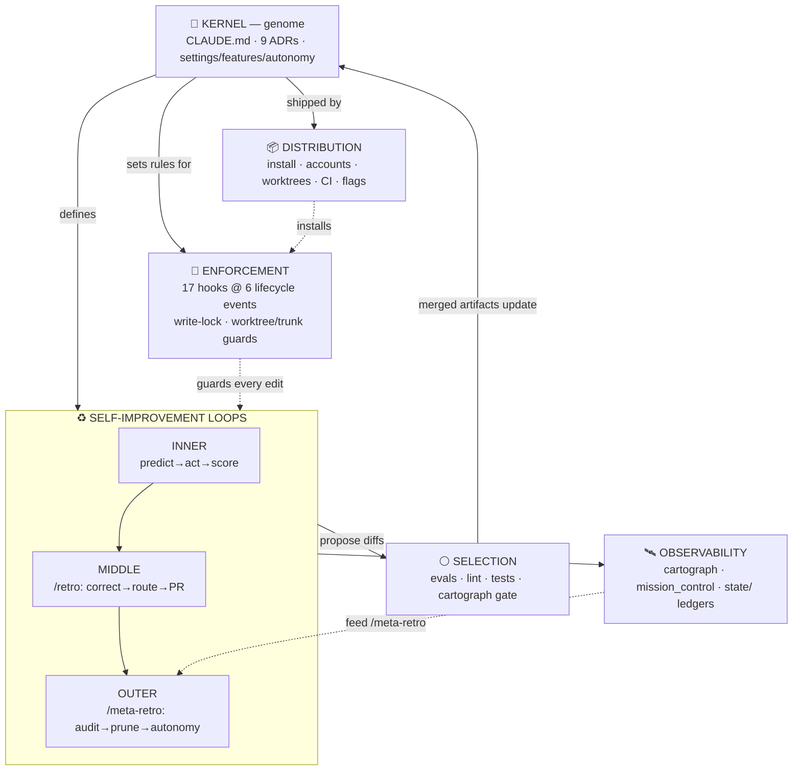
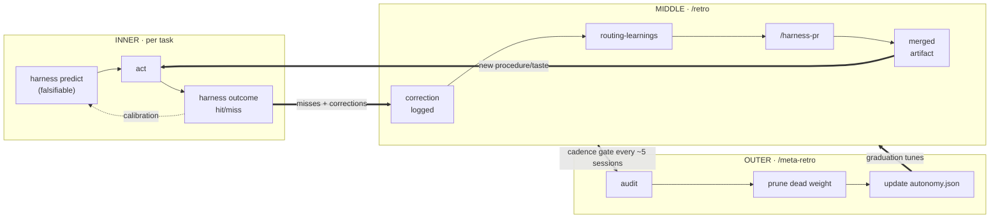
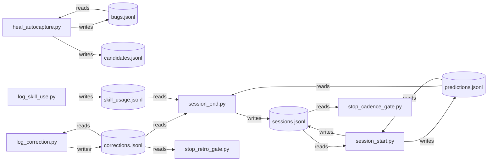

# The Harness Atlas - Structural Map

> **A holistic, machine-truth map of the recursive-harness - every component and how they flow and synergize.** Where the system *strains* (live friction, load, bug clusters) is the companion pulse: [`ATLAS-PULSE.md`](./ATLAS-PULSE.md).
>
> Generated by `cartograph/atlas.py` from the Living Harness Cartograph (`cartograph/extract.py`). Structure is **extracted machine-truth**; groupings marked `[curated overlay]` are design choices, never extracted facts. Regenerate to re-sync: `python cartograph/atlas.py` (or `/atlas`).

**Build stamp** - generated `2026-07-05` from extract.py @ `5727507`.

| Graph | Value |
|---|---|
| Nodes | **160** (adr=12, agent=4, cli=19, command=14, config=3, evals=12, event=6, hook=21, kernel=1, lint=1, session=38, skill=23, state=6) |
| Edges | **329** (born_in=63, cites=47, fires_on=22, invokes=45, nudges=69, references=34, spawns=19, touches=12, wires=18) |

**How to read this document.** Each section is a different *lens* on the one graph. Diagrams render natively on GitHub (Mermaid). These structural views change only when the harness itself changes - so this file diffs cleanly. The live snapshot of where the harness strains is kept separate in `ATLAS-PULSE.md`.

---

## 1. System-of-systems  `[curated overlay]`

The harness is six cooperating layers. The kernel sets the rules; the loops do the learning; enforcement keeps the agent from corrupting the harness while it learns; selection admits only changes that survive replay; observability lets the system see itself; distribution ships the one trunk to many account silos. Counts are live.

| Layer | Graph nodes | What it is |
|---|---:|---|
| **Kernel - the genome** | 16 | CLAUDE.md prime directives + ADRs + regulatory config; the conserved DNA every session reads. |
| **Self-improvement loops** | 60 | inner predict->act->score / middle /retro / outer /meta-retro - the three nested learning cycles. |
| **Enforcement - the immune system** | 27 | hooks fire at lifecycle membranes; the write-lock + worktree/trunk guards keep the agent from corrupting the harness. |
| **Selection - proof under replay** | 13 | evals corpus + lint + tests + the cartograph gate: only mutations that survive propagate. |
| **Observability - self-awareness** | 44 | cartograph (this map) + mission_control TUI + the state/ hot ledgers: the harness watching itself. |
| **Distribution - portability** | - | install/account-init/session-sync + templates + worktree machinery + CI + feature/autonomy flags: one trunk, many silos. |

> Node counts bucket the 131 graph nodes by type. *Loops* counts the procedural substrate the three cycles orchestrate (skills, commands, agents, CLI); §2 lists the loop-specific subset. *Distribution* is a filesystem layer the connectivity graph does not model - see the inventory in §7.

---

## 2. The three self-improvement loops  `[curated overlay layout · nodes extracted]`

This is the heart of the design: model weights are frozen, so *the repo* is the learnable layer. Every loop turns experience into a versioned diff. They nest - the inner loop's misses feed the middle loop's retros, whose cadence feeds the outer loop's audit.

**Extracted members of each loop** (machine-truth from the cartograph):

- **INNER · predict→act→score** (7): `harness outcome`, `harness predict`, `harness stats`, `/calibrate`, `stop_cadence_gate.py`, `calibration`, `predictions.jsonl`
- **MIDDLE · /retro** (18): `critic`, `harness-auditor`, `retro-miner`, `harness corrections`, `harness followup`, `/capture-eval`, `/followups`, `/harness-pr`, `/retro`, `log_correction.py`, `stop_retro_gate.py`, `eval-capture`, `follow-up-handling`, `harness-authoring`, `retrospection`, `routing-learnings`, `stuck-detection`, `corrections.jsonl`
- **OUTER · /meta-retro** (9): `harness gc`, `harness skill-stats`, `/gc`, `/meta-retro`, `/run-evals`, `/standup`, `autonomy.json`, `log_skill_use.py`, `skill_usage.jsonl`

---

## 3. Lifecycle - what fires when  `[extracted: fires_on edges + matchers]`

Almost nothing in the harness imports anything else; it is wired by **lifecycle triggers**. Each session passes through these membranes, and at each one a matcher-gated set of hooks fires. (Hooks below are listed alphabetically; the firing *sequence* is settings.json array order, not derivable from the graph - notably, within PreToolUse the write-lock `guard_enforcement_layer` is sequenced first, since editing the enforcement layer is the highest-threat path.)

```mermaid
flowchart TB
  EV_SessionStart(["SessionStart"])
  EV_SessionStart_h0["guard_worktree_session.py<br/><i>resume/clear</i>"]
  EV_SessionStart -.-> EV_SessionStart_h0
  EV_SessionStart_h1["inject_kernel.py<br/><i>startup/resume/clear/compact</i>"]
  EV_SessionStart -.-> EV_SessionStart_h1
  EV_SessionStart_h2["materialize_worktree_repos.py<br/><i>startup/resume/clear</i>"]
  EV_SessionStart -.-> EV_SessionStart_h2
  EV_SessionStart_h3["session_start.py<br/><i>startup/resume/clear</i>"]
  EV_SessionStart -.-> EV_SessionStart_h3
  EV_UserPromptSubmit(["UserPromptSubmit"])
  EV_SessionStart --> EV_UserPromptSubmit
  EV_UserPromptSubmit_h0["log_correction.py"]
  EV_UserPromptSubmit -.-> EV_UserPromptSubmit_h0
  EV_PreToolUse(["PreToolUse"])
  EV_UserPromptSubmit --> EV_PreToolUse
  EV_PreToolUse_h0["forbid_scratchpad.py<br/><i>Write/Bash</i>"]
  EV_PreToolUse -.-> EV_PreToolUse_h0
  EV_PreToolUse_h1["guard_enforcement_layer.py<br/><i>Edit/Write/MultiEdit/NotebookEdit/Bash</i>"]
  EV_PreToolUse -.-> EV_PreToolUse_h1
  EV_PreToolUse_h2["guard_git_worktree_safety.py<br/><i>Edit/Write/MultiEdit/NotebookEdit/Bash</i>"]
  EV_PreToolUse -.-> EV_PreToolUse_h2
  EV_PreToolUse_h3["guard_trunk_lease.py<br/><i>Edit/Write/MultiEdit/NotebookEdit/Bash/PowerShell</i>"]
  EV_PreToolUse -.-> EV_PreToolUse_h3
  EV_PreToolUse_h4["guard_worktree_isolation.py<br/><i>Read/Glob/Grep/Edit/Write/MultiEdit/NotebookEdit/Bash/PowerShell</i>"]
  EV_PreToolUse -.-> EV_PreToolUse_h4
  EV_PreToolUse_h5["guard_worktree_session.py<br/><i>Read/Glob/Grep/Edit/Write/MultiEdit/NotebookEdit/Bash</i>"]
  EV_PreToolUse -.-> EV_PreToolUse_h5
  EV_PreToolUse_h6["pre_merge_ci_gate.py<br/><i>Bash/PowerShell</i>"]
  EV_PreToolUse -.-> EV_PreToolUse_h6
  EV_PostToolUse(["PostToolUse"])
  EV_PreToolUse --> EV_PostToolUse
  EV_PostToolUse_h0["guard_trunk_lease.py<br/><i>Edit/Write/MultiEdit/NotebookEdit/Bash/PowerShell</i>"]
  EV_PostToolUse -.-> EV_PostToolUse_h0
  EV_PostToolUse_h1["heal_autocapture.py<br/><i>Bash/Edit/Write/MultiEdit</i>"]
  EV_PostToolUse -.-> EV_PostToolUse_h1
  EV_PostToolUse_h2["log_skill_use.py<br/><i>Skill</i>"]
  EV_PostToolUse -.-> EV_PostToolUse_h2
  EV_PostToolUse_h3["materialize_worktree_repos.py<br/><i>EnterWorktree</i>"]
  EV_PostToolUse -.-> EV_PostToolUse_h3
  EV_PostToolUse_h4["post_merge_return_to_trunk.py<br/><i>Bash</i>"]
  EV_PostToolUse -.-> EV_PostToolUse_h4
  EV_Stop(["Stop"])
  EV_PostToolUse --> EV_Stop
  EV_Stop_h0["stop_cadence_gate.py"]
  EV_Stop -.-> EV_Stop_h0
  EV_Stop_h1["stop_retro_gate.py"]
  EV_Stop -.-> EV_Stop_h1
  EV_Stop_h2["stop_skill_gap_gate.py"]
  EV_Stop -.-> EV_Stop_h2
  EV_SessionEnd(["SessionEnd"])
  EV_Stop --> EV_SessionEnd
  EV_SessionEnd_h0["guard_worktree_session.py"]
  EV_SessionEnd -.-> EV_SessionEnd_h0
  EV_SessionEnd_h1["session_end.py"]
  EV_SessionEnd -.-> EV_SessionEnd_h1
```

| Lifecycle event | Hooks that fire (matcher-gated) |
|---|---|
| **SessionStart** | `guard_worktree_session` · `inject_kernel` · `materialize_worktree_repos` · `session_start` |
| **UserPromptSubmit** | `log_correction` |
| **PreToolUse** | `forbid_scratchpad` · `guard_enforcement_layer` · `guard_git_worktree_safety` · `guard_trunk_lease` · `guard_worktree_isolation` · `guard_worktree_session` · `pre_merge_ci_gate` |
| **PostToolUse** | `guard_trunk_lease` · `heal_autocapture` · `log_skill_use` · `materialize_worktree_repos` · `post_merge_return_to_trunk` |
| **Stop** | `stop_cadence_gate` · `stop_retro_gate` · `stop_skill_gap_gate` |
| **SessionEnd** | `guard_worktree_session` · `session_end` |

---

## 4. State dataflow - the live signal pool  `[extracted: touches edges + mode]`

Hooks and the CLI are stateless between runs; their memory is the gitignored `state/*.jsonl` ledgers (the cytoplasm). Direction is extracted from each access: a producer **writes**, a consumer **reads**. This is how a correction logged at one lifecycle event reaches a gate at another.

| Ledger | Written by | Read by |
|---|---|---|
| **bugs.jsonl** | `heal_autocapture.py` | `heal_autocapture.py` |
| **candidates.jsonl** | `heal_autocapture.py` | - |
| **corrections.jsonl** | `log_correction.py` | `log_correction.py`, `session_end.py`, `stop_retro_gate.py` |
| **predictions.jsonl** | `session_start.py` | `session_end.py`, `session_start.py` |
| **sessions.jsonl** | `session_end.py`, `session_start.py` | `session_start.py`, `stop_cadence_gate.py` |
| **skill_usage.jsonl** | `log_skill_use.py` | `session_end.py` |

---

## 5. Dependency hotspots & blast radius  `[extracted: REF edges]`

Edges run consumer→provider, so a node's **in-degree** (how many artifacts cite / invoke / spawn / wire it) measures how load-bearing it is. The widest blast radius is where a contract change ripples furthest - edit these with the most care.

| Node | Type | In-degree | Blast radius (transitive dependents) |
|---|---|---:|---:|
| `/retro` | command | 15 | 48 |
| `/harness-pr` | command | 14 | 48 |
| `0008-feature-flags-config` | adr | 13 | 14 |
| `/meta-retro` | command | 12 | 48 |
| `0004-dual-config-topology` | adr | 10 | 51 |
| `harness-authoring` | skill | 9 | 48 |
| `/run-evals` | command | 8 | 48 |
| `critic` | agent | 8 | 51 |
| `harness-auditor` | agent | 7 | 49 |
| `harness outcome` | cli | 7 | 49 |
| `harness predict` | cli | 7 | 49 |
| `PreToolUse` | event | 7 | 8 |
| `routing-learnings` | skill | 6 | 48 |
| `harness followup` | cli | 6 | 49 |
| `harness stats` | cli | 6 | 49 |

---

## 6. Taxonomy - the legend

### Node roles  `[curated overlay: a biological metaphor]`

Each artifact type plays a cell-biology role. The metaphor is a memory aid, not a claim the extractor makes.

| Role | Maps to | Count | Function |
|---|---|---:|---|
| lineage | session | 38 | provenance ancestry (sessions) |
| ribosome | skill | 23 | translate trigger-signals into procedure (skills) |
| enzyme | hook | 21 | catalyse reactions at lifecycle membranes (hooks) |
| transporter | cli | 19 | move metabolites in/out of the ledgers (CLI) |
| receptor | command | 14 | user-initiated pathway entry points (commands) |
| nucleus | adr, kernel | 13 | versioned cold knowledge (genome / conserved genes) |
| selection | evals | 12 | only mutations that survive replay propagate (evals) |
| cytoplasm | state | 6 | the live signal pool (state ledgers) |
| membrane | event | 6 | gated lifecycle checkpoints (events) |
| organelle | agent | 4 | fresh-context isolated roles (agents) |
| regulatory | config | 3 | which enzyme docks at which membrane (config) |
| checkpoint | lint | 1 | the guard the cell can't self-disable (lint) |

### Edge relations  `[extracted from machine-truth]`

| Relation | Count | Meaning |
|---|---:|---|
| `nudges` | 69 | artifact → command (/cmd pointer) |
| `born_in` | 63 | artifact → session (provenance lineage) |
| `cites` | 47 | artifact → skill (skill references) |
| `invokes` | 45 | artifact → CLI subcommand (harness <cmd>) |
| `references` | 34 | artifact → ADR (ADR NNNN) |
| `fires_on` | 22 | hook → lifecycle event (settings.json wiring) |
| `spawns` | 19 | artifact → agent (agent references) |
| `wires` | 18 | config → hook (settings.json docks) |
| `touches` | 12 | actor → state ledger (writes/reads) |

---

## 7. Subsystem inventory  `[curated overlay · live file counts]`

The cartograph models the core loop artifacts; these are the larger subsystems it touches only at the edges. File counts are live (a subsystem that loses its files shows it here).

| Subsystem | Layer | Files | Status | What it is |
|---|---|---:|---|---|
| **cartograph** | observability | 23 | shipped | Read-only machine-truth extractor: graph + gate + audit + oracle + diff + html + this atlas. |
| **mission_control** | observability | 19 | shipped | Phosphor-console TUI: 3 read-only lenses (Roster/Map/Console) over harness state + live fleet feed. |
| **fleet** | observability | 39 | shipped | Append-only, self-reaping typed event log (Agent Mail) for cross-session/worktree coordination. |
| **hooks** | enforcement | 43 | shipped | 17 lifecycle hooks: the write-lock guard, worktree/trunk concurrency guards, gates, loggers. |
| **evals** | selection | 42 | shipped | In-session regression corpus (ADR-0003, no headless); replayed via /run-evals, graded by check.py. |
| **tests** | selection | 24 | shipped | Harness-level pytest integration suite for guards, features, hooks, state - run in CI. |
| **lint** | selection | 2 | shipped | Self-governance linter: budgets, falsifiable claims, provenance, autonomy firewall. |
| **memory** | kernel | 20 | shipped | Versioned cold knowledge: ADRs, user-model (evidence-tagged), calibration rollups, heal ledgers. |
| **distribution** | distribution | 2 | shipped | install.sh / account-init.sh / sync-account-sessions / templates: one-trunk multi-silo install. |

---

## 8. Gaps, rot & structural integrity  `[extracted: the gate + audit]`

The cartograph doubles as a connectivity linter. This is the same set the `--check` gate blocks on and the `--audit` feed surfaces for `/meta-retro` - nothing here is hand-flagged.

- **Structural rot (gate-blocking):** 0 ✅ clean
- **Dead-weight prune candidates:** 0 ✅ none
- **Benign notes (classified, not problems):**
  - hook _guard_common.py is a shared library imported by other hooks (not event-wired - expected, not dead)
  - hook _wtpaths.py is a shared library imported by other hooks (not event-wired - expected, not dead)
  - hook harness_features.py is a shared library imported by other hooks (not event-wired - expected, not dead)

> The audit can only *surface* candidates; it can never prune. That firewall - audit advises, gate blocks, neither acts - is the anti-reward-hack guarantee: a map that could delete its own nodes to look clean is exactly the corruption mode the kernel warns against.

---
