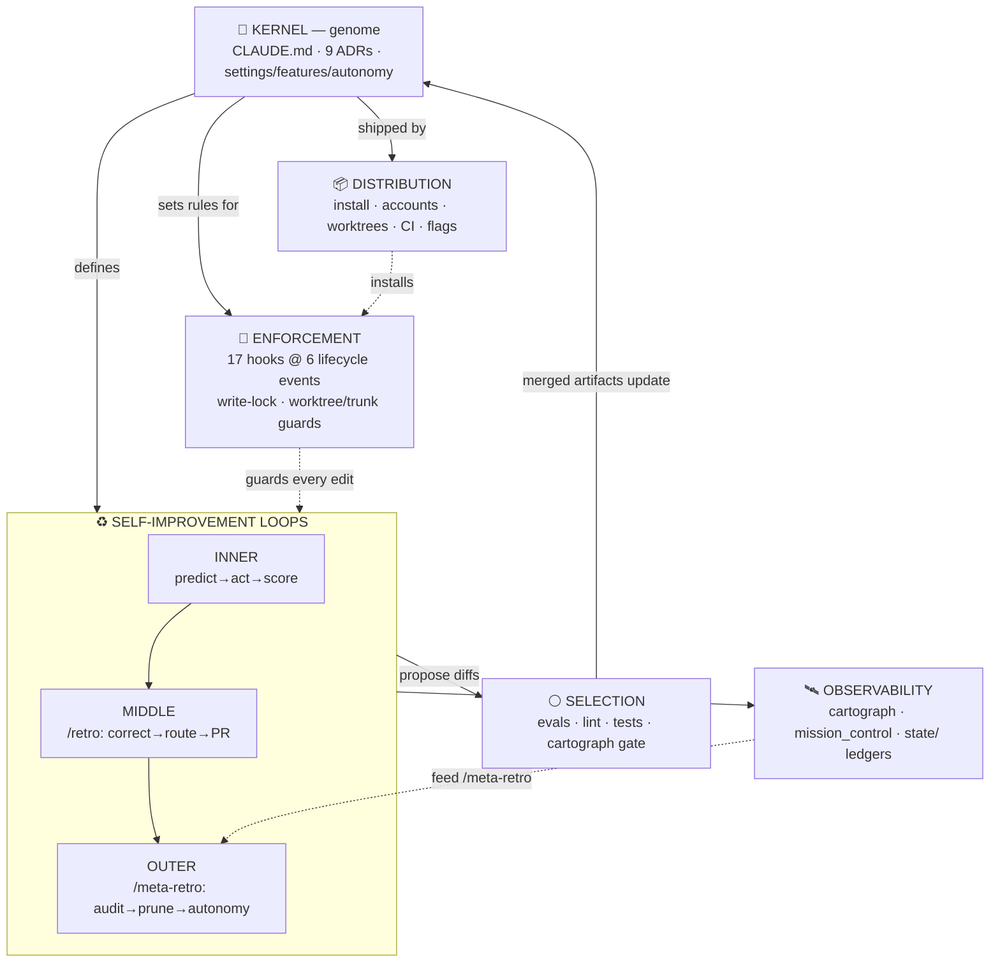
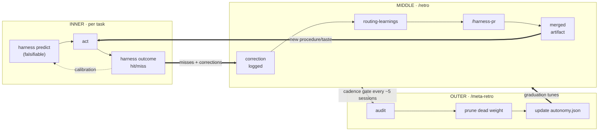
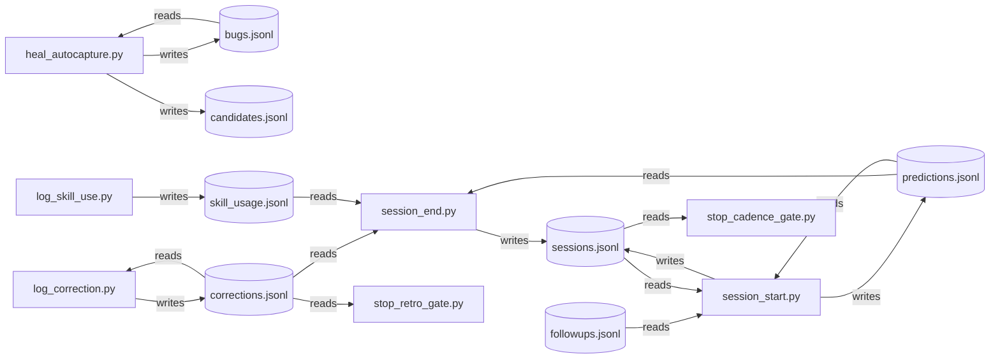

# The Harness Atlas

> **A holistic, machine-truth map of the recursive-harness - every component, how they flow and synergize, and where the system strains.**
>
> Generated by `cartograph/atlas.py` from the Living Harness Cartograph (`cartograph/extract.py`). Structure is **extracted machine-truth**; groupings marked `[curated overlay]` are design choices, never extracted facts. Regenerate to re-sync: `python cartograph/atlas.py`.

**Build stamp** - generated `2026-06-27` from extract.py @ `5b1ee6b`.

| Graph | Value |
|---|---|
| Nodes | **132** (adr=9, agent=4, cli=13, command=13, config=3, evals=10, event=6, hook=17, kernel=1, lint=1, session=29, skill=19, state=7) |
| Edges | **283** (born_in=52, cites=39, fires_on=20, invokes=36, nudges=61, references=28, spawns=18, touches=13, wires=16) |
| Prediction calibration | **79%** hit-rate (131 hit / 34 miss / 1 open over 166) |
| Open follow-ups | 27 |

**How to read this document.** Each section is a different *lens* on the one graph. Diagrams render natively on GitHub (Mermaid). The structural views change only when the harness changes; the **Observability snapshot** at the end is a point-in-time read of the live `state/` ledgers (the canonical main-checkout copy).

---

## 1. System-of-systems  `[curated overlay]`

The harness is six cooperating layers. The kernel sets the rules; the loops do the learning; enforcement keeps the agent from corrupting the harness while it learns; selection admits only changes that survive replay; observability lets the system see itself; distribution ships the one trunk to many account silos. Counts are live.

| Layer | Graph nodes | What it is |
|---|---:|---|
| **Kernel - the genome** | 13 | CLAUDE.md prime directives + ADRs + regulatory config; the conserved DNA every session reads. |
| **Self-improvement loops** | 49 | inner predict->act->score / middle /retro / outer /meta-retro - the three nested learning cycles. |
| **Enforcement - the immune system** | 23 | hooks fire at lifecycle membranes; the write-lock + worktree/trunk guards keep the agent from corrupting the harness. |
| **Selection - proof under replay** | 11 | evals corpus + lint + tests + the cartograph gate: only mutations that survive propagate. |
| **Observability - self-awareness** | 36 | cartograph (this map) + mission_control TUI + the state/ hot ledgers: the harness watching itself. |
| **Distribution - portability** | - | install/account-init/session-sync + templates + worktree machinery + CI + feature/autonomy flags: one trunk, many silos. |

> Node counts bucket the 131 graph nodes by type. *Loops* counts the procedural substrate the three cycles orchestrate (skills, commands, agents, CLI); §2 lists the loop-specific subset. *Distribution* is a filesystem layer the connectivity graph does not model - see the inventory in §7.

---

## 2. The three self-improvement loops  `[curated overlay layout · nodes extracted]`

This is the heart of the design: model weights are frozen, so *the repo* is the learnable layer. Every loop turns experience into a versioned diff. They nest - the inner loop's misses feed the middle loop's retros, whose cadence feeds the outer loop's audit.

**Extracted members of each loop** (machine-truth from the cartograph):

- **INNER · predict→act→score** (7): `harness outcome`, `harness predict`, `harness stats`, `/calibrate`, `stop_cadence_gate.py`, `calibration`, `predictions.jsonl`
- **MIDDLE · /retro** (19): `critic`, `harness-auditor`, `retro-miner`, `harness corrections`, `harness followup`, `/capture-eval`, `/followups`, `/harness-pr`, `/retro`, `log_correction.py`, `stop_retro_gate.py`, `eval-capture`, `follow-up-handling`, `harness-authoring`, `retrospection`, `routing-learnings`, `stuck-detection`, `corrections.jsonl`, `followups.jsonl`
- **OUTER · /meta-retro** (9): `harness gc`, `harness skill-stats`, `/gc`, `/meta-retro`, `/run-evals`, `/standup`, `autonomy.json`, `log_skill_use.py`, `skill_usage.jsonl`

---

## 3. Lifecycle - what fires when  `[extracted: fires_on edges + matchers]`

Almost nothing in the harness imports anything else; it is wired by **lifecycle triggers**. Each session passes through these membranes, and at each one a matcher-gated set of hooks fires. (Hooks below are listed alphabetically; the firing *sequence* is settings.json array order, not derivable from the graph - notably, within PreToolUse the write-lock `guard_enforcement_layer` is sequenced first, since editing the enforcement layer is the highest-threat path.)

```mermaid
flowchart TB
  EV_SessionStart(["SessionStart"])
  EV_SessionStart_h0["guard_worktree_session.py<br/><i>resume/clear</i>"]
  EV_SessionStart -.-> EV_SessionStart_h0
  EV_SessionStart_h1["inject_kernel.py<br/><i>startup/resume/clear/compact</i>"]
  EV_SessionStart -.-> EV_SessionStart_h1
  EV_SessionStart_h2["materialize_worktree_repos.py<br/><i>startup/resume/clear</i>"]
  EV_SessionStart -.-> EV_SessionStart_h2
  EV_SessionStart_h3["session_start.py<br/><i>startup/resume/clear</i>"]
  EV_SessionStart -.-> EV_SessionStart_h3
  EV_UserPromptSubmit(["UserPromptSubmit"])
  EV_SessionStart --> EV_UserPromptSubmit
  EV_UserPromptSubmit_h0["log_correction.py"]
  EV_UserPromptSubmit -.-> EV_UserPromptSubmit_h0
  EV_PreToolUse(["PreToolUse"])
  EV_UserPromptSubmit --> EV_PreToolUse
  EV_PreToolUse_h0["forbid_scratchpad.py<br/><i>Write/Bash</i>"]
  EV_PreToolUse -.-> EV_PreToolUse_h0
  EV_PreToolUse_h1["guard_enforcement_layer.py<br/><i>Edit/Write/MultiEdit/NotebookEdit/Bash</i>"]
  EV_PreToolUse -.-> EV_PreToolUse_h1
  EV_PreToolUse_h2["guard_git_worktree_safety.py<br/><i>Edit/Write/MultiEdit/NotebookEdit/Bash</i>"]
  EV_PreToolUse -.-> EV_PreToolUse_h2
  EV_PreToolUse_h3["guard_trunk_lease.py<br/><i>Edit/Write/MultiEdit/NotebookEdit/Bash/PowerShell</i>"]
  EV_PreToolUse -.-> EV_PreToolUse_h3
  EV_PreToolUse_h4["guard_worktree_isolation.py<br/><i>Read/Glob/Grep/Edit/Write/MultiEdit/NotebookEdit/Bash/PowerShell</i>"]
  EV_PreToolUse -.-> EV_PreToolUse_h4
  EV_PreToolUse_h5["guard_worktree_session.py<br/><i>Read/Glob/Grep/Edit/Write/MultiEdit/NotebookEdit/Bash</i>"]
  EV_PreToolUse -.-> EV_PreToolUse_h5
  EV_PostToolUse(["PostToolUse"])
  EV_PreToolUse --> EV_PostToolUse
  EV_PostToolUse_h0["guard_trunk_lease.py<br/><i>Edit/Write/MultiEdit/NotebookEdit/Bash/PowerShell</i>"]
  EV_PostToolUse -.-> EV_PostToolUse_h0
  EV_PostToolUse_h1["heal_autocapture.py<br/><i>Bash/Edit/Write/MultiEdit</i>"]
  EV_PostToolUse -.-> EV_PostToolUse_h1
  EV_PostToolUse_h2["log_skill_use.py<br/><i>Skill</i>"]
  EV_PostToolUse -.-> EV_PostToolUse_h2
  EV_PostToolUse_h3["materialize_worktree_repos.py<br/><i>EnterWorktree</i>"]
  EV_PostToolUse -.-> EV_PostToolUse_h3
  EV_PostToolUse_h4["post_merge_return_to_trunk.py<br/><i>Bash</i>"]
  EV_PostToolUse -.-> EV_PostToolUse_h4
  EV_Stop(["Stop"])
  EV_PostToolUse --> EV_Stop
  EV_Stop_h0["stop_cadence_gate.py"]
  EV_Stop -.-> EV_Stop_h0
  EV_Stop_h1["stop_retro_gate.py"]
  EV_Stop -.-> EV_Stop_h1
  EV_SessionEnd(["SessionEnd"])
  EV_Stop --> EV_SessionEnd
  EV_SessionEnd_h0["guard_worktree_session.py"]
  EV_SessionEnd -.-> EV_SessionEnd_h0
  EV_SessionEnd_h1["session_end.py"]
  EV_SessionEnd -.-> EV_SessionEnd_h1
```

| Lifecycle event | Hooks that fire (matcher-gated) |
|---|---|
| **SessionStart** | `guard_worktree_session` · `inject_kernel` · `materialize_worktree_repos` · `session_start` |
| **UserPromptSubmit** | `log_correction` |
| **PreToolUse** | `forbid_scratchpad` · `guard_enforcement_layer` · `guard_git_worktree_safety` · `guard_trunk_lease` · `guard_worktree_isolation` · `guard_worktree_session` |
| **PostToolUse** | `guard_trunk_lease` · `heal_autocapture` · `log_skill_use` · `materialize_worktree_repos` · `post_merge_return_to_trunk` |
| **Stop** | `stop_cadence_gate` · `stop_retro_gate` |
| **SessionEnd** | `guard_worktree_session` · `session_end` |

---

## 4. State dataflow - the live signal pool  `[extracted: touches edges + mode]`

Hooks and the CLI are stateless between runs; their memory is the gitignored `state/*.jsonl` ledgers (the cytoplasm). Direction is extracted from each access: a producer **writes**, a consumer **reads**. This is how a correction logged at one lifecycle event reaches a gate at another.

| Ledger | Written by | Read by |
|---|---|---|
| **bugs.jsonl** | `heal_autocapture.py` | `heal_autocapture.py` |
| **candidates.jsonl** | `heal_autocapture.py` | - |
| **corrections.jsonl** | `log_correction.py` | `log_correction.py`, `session_end.py`, `stop_retro_gate.py` |
| **followups.jsonl** | - | `session_start.py` |
| **predictions.jsonl** | `session_start.py` | `session_end.py`, `session_start.py` |
| **sessions.jsonl** | `session_end.py`, `session_start.py` | `session_start.py`, `stop_cadence_gate.py` |
| **skill_usage.jsonl** | `log_skill_use.py` | `session_end.py` |

---

## 5. Dependency hotspots & blast radius  `[extracted: REF edges]`

Edges run consumer→provider, so a node's **in-degree** (how many artifacts cite / invoke / spawn / wire it) measures how load-bearing it is. The widest blast radius is where a contract change ripples furthest - edit these with the most care.

| Node | Type | In-degree | Blast radius (transitive dependents) |
|---|---|---:|---:|
| `/harness-pr` | command | 14 | 41 |
| `/retro` | command | 12 | 41 |
| `0008-feature-flags-config` | adr | 12 | 13 |
| `/meta-retro` | command | 10 | 41 |
| `harness-authoring` | skill | 8 | 41 |
| `/run-evals` | command | 7 | 41 |
| `critic` | agent | 7 | 43 |
| `harness-auditor` | agent | 7 | 42 |
| `harness followup` | cli | 7 | 42 |
| `routing-learnings` | skill | 6 | 41 |
| `harness stats` | cli | 6 | 42 |
| `PreToolUse` | event | 6 | 7 |
| `auto-healer` | skill | 5 | 41 |
| `0004-dual-config-topology` | adr | 5 | 42 |
| `harness outcome` | cli | 5 | 42 |

---

## 6. Taxonomy - the legend

### Node roles  `[curated overlay: a biological metaphor]`

Each artifact type plays a cell-biology role. The metaphor is a memory aid, not a claim the extractor makes.

| Role | Maps to | Count | Function |
|---|---|---:|---|
| lineage | session | 29 | provenance ancestry (sessions) |
| ribosome | skill | 19 | translate trigger-signals into procedure (skills) |
| enzyme | hook | 17 | catalyse reactions at lifecycle membranes (hooks) |
| receptor | command | 13 | user-initiated pathway entry points (commands) |
| transporter | cli | 13 | move metabolites in/out of the ledgers (CLI) |
| nucleus | adr, kernel | 10 | versioned cold knowledge (genome / conserved genes) |
| selection | evals | 10 | only mutations that survive replay propagate (evals) |
| cytoplasm | state | 7 | the live signal pool (state ledgers) |
| membrane | event | 6 | gated lifecycle checkpoints (events) |
| organelle | agent | 4 | fresh-context isolated roles (agents) |
| regulatory | config | 3 | which enzyme docks at which membrane (config) |
| checkpoint | lint | 1 | the guard the cell can't self-disable (lint) |

### Edge relations  `[extracted from machine-truth]`

| Relation | Count | Meaning |
|---|---:|---|
| `nudges` | 61 | artifact → command (/cmd pointer) |
| `born_in` | 52 | artifact → session (provenance lineage) |
| `cites` | 39 | artifact → skill (skill references) |
| `invokes` | 36 | artifact → CLI subcommand (harness <cmd>) |
| `references` | 28 | artifact → ADR (ADR NNNN) |
| `fires_on` | 20 | hook → lifecycle event (settings.json wiring) |
| `spawns` | 18 | artifact → agent (agent references) |
| `wires` | 16 | config → hook (settings.json docks) |
| `touches` | 13 | actor → state ledger (writes/reads) |

---

## 7. Subsystem inventory  `[curated overlay · live file counts]`

The cartograph models the core loop artifacts; these are the larger subsystems it touches only at the edges. File counts are live (a subsystem that loses its files shows it here).

| Subsystem | Layer | Files | Status | What it is |
|---|---|---:|---|---|
| **cartograph** | observability | 17 | shipped | Read-only machine-truth extractor: graph + gate + audit + oracle + diff + html + this atlas. |
| **mission_control** | observability | 15 | shipped | Phosphor-console TUI: 3 read-only lenses (Roster/Map/Console) over harness state + live fleet feed. |
| **fleet** | observability | 3 | shipped | Append-only, self-reaping typed event log (Agent Mail) for cross-session/worktree coordination. |
| **hooks** | enforcement | 34 | shipped | 17 lifecycle hooks: the write-lock guard, worktree/trunk concurrency guards, gates, loggers. |
| **evals** | selection | 32 | shipped | In-session regression corpus (ADR-0003, no headless); replayed via /run-evals, graded by check.py. |
| **tests** | selection | 19 | shipped | Harness-level pytest integration suite for guards, features, hooks, state - run in CI. |
| **lint** | selection | 1 | shipped | Self-governance linter: budgets, falsifiable claims, provenance, autonomy firewall. |
| **memory** | kernel | 12 | shipped | Versioned cold knowledge: ADRs, user-model (evidence-tagged), calibration rollups, heal ledgers. |
| **distribution** | distribution | 1 | shipped | install.sh / account-init.sh / sync-account-sessions / templates: one-trunk multi-silo install. |

---

## 8. Gaps, rot & structural integrity  `[extracted: the gate + audit]`

The cartograph doubles as a connectivity linter. This is the same set the `--check` gate blocks on and the `--audit` feed surfaces for `/meta-retro` - nothing here is hand-flagged.

- **Structural rot (gate-blocking):** 0 ✅ clean
- **Dead-weight prune candidates:** 0 ✅ none
- **Benign notes (classified, not problems):**
  - hook harness_features.py is a shared library imported by other hooks (not event-wired - expected, not dead)

> The audit can only *surface* candidates; it can never prune. That firewall - audit advises, gate blocks, neither acts - is the anti-reward-hack guarantee: a map that could delete its own nodes to look clean is exactly the corruption mode the kernel warns against.

---

## 9. Observability snapshot  `[point-in-time read of state/]`

Live machine-state, not topology. This is the section that drifts session to session - regenerate to re-sync. It answers *where the system strains*.

### Friction hotspots - prediction reliability by category

Where the agent is *least* calibrated is where work is hardest / least understood - a cognitive bottleneck. Low hit-rate categories are prime `/retro` and eval-capture targets.

| Category | Hit | Miss | Hit-rate | Signal |
|---|---:|---:|---:|---|
| enforcement-hooks | 0 | 2 | 0% | ⚠ friction |
| hooks | 0 | 1 | 0% |  |
| design | 1 | 2 | 33% | ⚠ friction |
| harness-authoring | 1 | 1 | 50% | ⚠ friction |
| harness | 1 | 1 | 50% | ⚠ friction |
| implementation | 3 | 2 | 60% |  |
| general | 107 | 23 | 82% |  |
| build | 11 | 2 | 85% |  |
| debugging | 1 | 0 | 100% |  |
| coding | 1 | 0 | 100% |  |
| brand-foundry-dogfood | 3 | 0 | 100% | ✅ strong |
| feature-build | 2 | 0 | 100% | ✅ strong |

### Load - most-fired skills (this window)

| Skill | Fires |
|---|---:|
| `retro` | 21 |
| `run-evals` | 13 |
| `calibration` | 12 |
| `harness-authoring` | 9 |
| `worktree` | 9 |
| `standup` | 8 |
| `build-loop` | 8 |
| `brainstorm` | 5 |
| `harness-pr` | 4 |
| `routing-learnings` | 3 |

### Backlog & friction

- Open follow-ups: **27**
- Corrections logged (all-time ledger): **88**

### Where bugs cluster - the heal ledger

Aggregate vital sign (this repo): **3 bugs** (2 live / 1 healed), recurrence_rate **0.0**, stuck **0**, escalate **0**. A *rising* recurrence rate month-over-month is the harness healing worse - mine via `/retro`.

Bug clusters by tag (the heal ledger tags each bug `file:` / `class:` / `area:` / `host:` / `lang:` - so the tag histogram *is* the clustering):

- **`recursive-harness-481a64`** - 3 bugs (2 live, 0 recurring): `lang:powershell`×2, `file:bin/harness`, `class:encoding`, `area:cli`, `host:windows`, `encoding:utf8-no-bom`, `op:dir-move`, `atomicity`
- **`retro-synth-session-a43e3c`** - 1 bug (1 live, 0 recurring): `facet:worktree`, `facet:hook`, `facet:return-to-trunk`

---

_Atlas generated by `cartograph/atlas.py`. To keep this map true as the harness evolves, regenerate after structural changes (or wire it into `/retro` / CI). The cartograph gate (`extract.py --check`) already fails CI on un-baselined structural rot._
