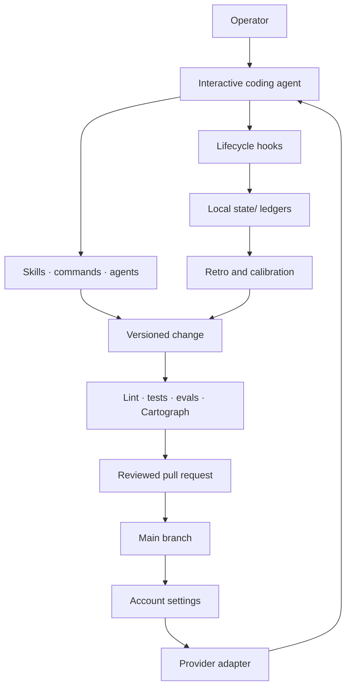

# Architecture

Recursive Harness is a repository-backed control plane for interactive coding agents. It
does not train or proxy the model. It controls which instructions load, reacts to lifecycle
events, records selected evidence, routes learnings into versioned artifacts, and verifies
the resulting changes.

Claude Code is the only fully shipped provider integration today, and its account silo is an
advanced reference runtime rather than the public portability default. The default is a
non-invasive sidecar: inspect without reading contents, preserve existing configuration,
and invoke explicit capabilities without adding repository policy. The kernel, procedures,
and evidence model are canonical; provider lifecycle events, installation metadata, and
host-specific commands belong in generated adapters. OpenAI/Codex and other adapters must
prove this boundary before the product claims general multi-agent compatibility. The
experimental OpenAI/Codex Specialization plugin is a narrow second-provider proof, not a
claim that the whole harness supports Codex or agents generally.

## System boundaries

There are five functional planes.

| Plane | Main artifacts | Responsibility |
| --- | --- | --- |
| Kernel | `CLAUDE.md`, `memory/decisions/`, `autonomy.json` | Small invariants, architecture, and earned automation policy |
| Adapter | `settings.json`, `templates/`, provider packages | Translate host lifecycle, tool, and installation contracts without owning reusable behavior |
| Runtime | `settings.json`, `templates/`, `hooks/` | Lifecycle wiring, safety gates, local signal capture, and session coordination |
| Procedure | `skills/`, `commands/`, `agents/` | Triggered workflows, routing, review, and task-specific behavior |
| Evidence | `lint/`, `tests/`, `evals/`, `cartograph/` | Governance checks, behavior tests, regression cases, and structural truth |

`bin/harness`, `fleet/`, and `mission_control/` cross those planes by exposing local state,
coordination events, and operator views without becoming a second source of policy.

## The feedback loops

### Task loop

Before a meaningful action, `harness predict` records a falsifiable expectation and
confidence. After reality is known, `harness outcome` records hit or miss. Pending outcomes
remain debt, and the calibration report compares confidence with observed accuracy.

### Session loop

Local hooks can record correction signals, skill use, failure candidates, and session
metadata. `/retro` reviews those signals, rejects noise, and routes a durable lesson to the
smallest correct artifact. Changes still travel through a branch, tests, review, and a pull
request.

### Portfolio loop

`/meta-retro` consumes rollups, structural audits, skill-use evidence, eval coverage, and
acceptance history. It can propose pruning or wider autonomy, but it cannot silently edit
the enforcement layer or approve its own measuring rules.

## Capability ownership and adapters

Reusable skills, governance, ledgers, tests, and safety semantics have one source in this
repository. A provider package may expose those capabilities in the format a host expects,
but it must not become an independently edited second harness. Each adapter must declare:

- which canonical capabilities and version it packages;
- how host events map to the runtime lifecycle, including unsupported events;
- which shared fixtures it passes;
- how installation, upgrade, rollback, and removal work; and
- which safety guarantees remain provider-specific.

The machine-readable [capability catalog](../capabilities/catalog.json) maps six packages:
Observe, Learn, Verify, Coordinate, Guard, and Lab. Observe, Learn, Verify, and Coordinate are
`generated-beta` generic Agent Skill, Claude, and Codex packages with canonical-source receipts
and isolated consumer evidence. Guard is a separate `generated-beta` local Codex package that is
inert without a reviewed repository policy and can never arrive as a hidden dependency.
Coordinate is local-only and makes no distributed or remote-service claim. Lab remains `planned`,
not a published plugin. Advisory capabilities prohibit default repository writes and operational
capabilities disclose their state.

The detailed Agentic Dev OS adoption and rejection decisions live in the
[consolidation map](comparisons/agentic-dev-os.md). It is the drain checklist for that
repository, not a reason to preserve two active control planes.

The first extracted contract is [Specialization](specialization-provider-contract.md).
`skills/specialization/` owns its semantics and tests. The generated package under
`plugins/recursive-specialization/` maps Codex lifecycle events and carries a source-hash
receipt; CI rejects drift between its runtime and the canonical files.

## Runtime lifecycle

The shipped Claude adapter uses `settings.json` and `templates/account-settings.json` to
wire six Claude Code lifecycle events. The generated account settings use absolute checkout
paths, while hook code remains linked to the current checkout.

| Event | Representative behavior |
| --- | --- |
| `SessionStart` | Verify/load context, surface calibration and debt, materialize configured worktree repositories, and adopt session ownership |
| `UserPromptSubmit` | Record likely correction signals locally when enabled |
| `PreToolUse` | Protect enforcement paths, worktree boundaries, concurrent sessions, trunk leases, reverts, and red-PR merges |
| `PostToolUse` | Refresh coordination leases and record selected skill use |
| `Stop` | Surface retro cadence plus first-observation candidate dogfood and promotion-ready specialization work |
| `SessionEnd` | Summarize/reap local coordination state and release ownership |

Hook provenance is traced in [memory/nudge-provenance.md](../memory/nudge-provenance.md).
Feature defaults live in `features.json`; safety-critical keys cannot be weakened through
the ignored local override file.

## State and data flow

| Store | Lifetime | Contents | Authority |
| --- | --- | --- | --- |
| `state/` | Hot, local, ignored | Predictions, corrections, follow-ups, failures, approvals, leases, skill use, and Fleet events | Operational evidence; never durable policy by itself |
| Platform user-state directory | Hot, local, provider-neutral | Specialization evidence, private candidates, dogfood receipts, and migration receipts | Shared operational evidence for local provider adapters; never canonical policy |
| `.claude-private/` | Local, ignored | Generated account settings and Claude Code session stores | Runtime configuration and transcripts |
| `memory/` | Cold, versioned | Decisions, evidence-backed user model, calibration/heal rollups, and provenance | Reviewed durable knowledge |
| `evals/` | Versioned | Regression fixtures and last replay evidence | Selection evidence; replay is interactive |
| Git history | Durable, public | Reviewed code, documentation, proposals, and provenance | Canonical learning record |

Privacy-bearing ledgers route through `private_state.py`: writes are sanitized, appends are
serialized across processes, rewrites are atomic, and supported files/directories are
owner-only. Session end expires raw correction/failure excerpts past the configured window
without deleting their evidence metadata. `/gc` rolls selected statistics into versioned
memory. Raw excerpts do not automatically become durable knowledge; promotion requires review. See
[PRIVACY.md](../PRIVACY.md) for the exact data boundary.

## Enforcement boundary

The guarded layer includes `hooks/`, `lint/`, `evals/`, `bin/`, `.github/`,
`autonomy.json`, `features.json`, `settings.json`, and `templates/`. Mutating it requires an
explicit human approval marker and the repository's harness-PR workflow. The guard is
designed to prevent an agent from improving its score by weakening the scorer.

This boundary is not a sandbox. Hooks and procedures execute with the operator's account
permissions, and one-off escape hatches exist for intentional recovery. Branch protection,
CI, review, OS permissions, and repository trust remain separate controls.

## Adoption and distribution topology

The safe default is `scripts/recursive_inspect.py` plus explicit personal-sidecar commands.
Inspection reports known configuration paths without printing their contents or changing a
byte. Existing instructions and provider settings remain authoritative. Team integration is
an exact reviewed patch or pull request; Recursive does not infer precedence.

The full Claude reference runtime uses a single checkout with per-account silos under
`.claude-private/accounts/`. Each silo links its procedure directories back to the checkout
and materializes settings from one portable template. One locally selected account owns the
shared session store; the ignored `session-store-account` file keeps that choice stable.
Multiple populated stores converge through the lossless sync step documented in
[Distribution](../DISTRIBUTION.md). `launch.sh` and `launch.ps1` preserve the target working
directory but deliberately select the silo's `CLAUDE_CONFIG_DIR`; they isolate Recursive
from the normal Claude configuration rather than composing the two.

Provider packages will be generated from canonical capability sources with source-hash
receipts. Skills carry procedures, runtime code owns deterministic state and privacy,
provider hooks map lifecycle events, and CI/repository policy owns merge enforcement. A
missing host event reduces the supported mode instead of being papered over by prompt text.

## Structural source of truth

Cartograph extracts the current graph from files, settings, lifecycle wiring, citations,
and state references. Use these generated/read-only interfaces instead of maintaining a
second hand-drawn inventory:

- [ATLAS.md](../cartograph/ATLAS.md) for system, loop, lifecycle, dataflow, hotspot, and
  subsystem lenses
- `python3 bin/harness ask --context <node>` for a focused structural brief
- `python3 bin/harness ask <query> <target>` for dependencies, dependents, paths, traces,
  and blast radius
- `python3 cartograph/extract.py --check` for the structural-rot gate

The founding architecture decisions are in [memory/decisions/](../memory/decisions/).
