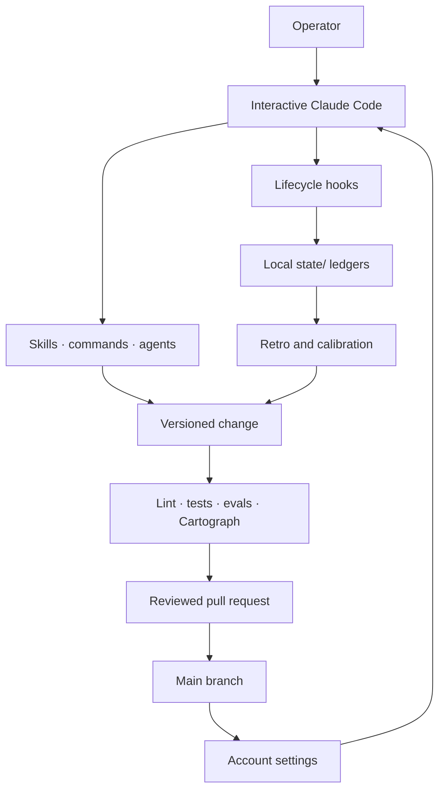

# Architecture

Recursive Harness is a repository-backed control plane around an interactive Claude Code
session. It does not train or proxy the model. It controls which instructions load, reacts
to lifecycle events, records selected evidence, routes learnings into versioned artifacts,
and verifies the resulting changes.

## System boundaries

There are four functional planes.

| Plane | Main artifacts | Responsibility |
| --- | --- | --- |
| Kernel | `CLAUDE.md`, `memory/decisions/`, `autonomy.json` | Small invariants, architecture, and earned automation policy |
| Runtime | `settings.json`, `templates/`, `hooks/` | Lifecycle wiring, safety gates, local signal capture, and session coordination |
| Procedure | `skills/`, `commands/`, `agents/` | Triggered workflows, routing, review, and task-specific behavior |
| Evidence | `lint/`, `tests/`, `evals/`, `cartograph/` | Governance checks, behavior tests, regression cases, and structural truth |

`bin/harness`, `fleet/`, and `mission_control/` cross those planes by exposing local state,
coordination events, and operator views without becoming a second source of policy.

## The feedback loops

### Task loop

Before a meaningful action, `harness predict` records a falsifiable expectation and
confidence. After reality is known, `harness outcome` records hit or miss. Pending outcomes
remain debt, and the calibration report compares confidence with observed accuracy.

### Session loop

Local hooks can record correction signals, skill use, failure candidates, and session
metadata. `/retro` reviews those signals, rejects noise, and routes a durable lesson to the
smallest correct artifact. Changes still travel through a branch, tests, review, and a pull
request.

### Portfolio loop

`/meta-retro` consumes rollups, structural audits, skill-use evidence, eval coverage, and
acceptance history. It can propose pruning or wider autonomy, but it cannot silently edit
the enforcement layer or approve its own measuring rules.

## Runtime lifecycle

`settings.json` and `templates/account-settings.json` wire six Claude Code lifecycle events.
The generated account settings use absolute checkout paths, while hook code remains linked
to the current checkout.

| Event | Representative behavior |
| --- | --- |
| `SessionStart` | Verify/load context, surface calibration and debt, materialize configured worktree repositories, and adopt session ownership |
| `UserPromptSubmit` | Record likely correction signals locally when enabled |
| `PreToolUse` | Protect enforcement paths, worktree boundaries, concurrent sessions, trunk leases, reverts, and red-PR merges |
| `PostToolUse` | Refresh coordination leases and record selected skill use |
| `Stop` | Surface retro cadence and specialization gaps |
| `SessionEnd` | Summarize/reap local coordination state and release ownership |

Hook provenance is traced in [memory/nudge-provenance.md](../memory/nudge-provenance.md).
Feature defaults live in `features.json`; safety-critical keys cannot be weakened through
the ignored local override file.

## State and data flow

| Store | Lifetime | Contents | Authority |
| --- | --- | --- | --- |
| `state/` | Hot, local, ignored | Predictions, corrections, follow-ups, failures, approvals, leases, skill use, and Fleet events | Operational evidence; never durable policy by itself |
| `.claude-private/` | Local, ignored | Generated account settings and Claude Code session stores | Runtime configuration and transcripts |
| `memory/` | Cold, versioned | Decisions, evidence-backed user model, calibration/heal rollups, and provenance | Reviewed durable knowledge |
| `evals/` | Versioned | Regression fixtures and last replay evidence | Selection evidence; replay is interactive |
| Git history | Durable, public | Reviewed code, documentation, proposals, and provenance | Canonical learning record |

Privacy-bearing ledgers route through `private_state.py`: writes are sanitized, appends are
serialized across processes, rewrites are atomic, and supported files/directories are
owner-only. Session end expires raw correction/failure excerpts past the configured window
without deleting their evidence metadata. `/gc` rolls selected statistics into versioned
memory. Raw excerpts do not automatically become durable knowledge; promotion requires review. See
[PRIVACY.md](../PRIVACY.md) for the exact data boundary.

## Enforcement boundary

The guarded layer includes `hooks/`, `lint/`, `evals/`, `bin/`, `.github/`,
`autonomy.json`, `features.json`, `settings.json`, and `templates/`. Mutating it requires an
explicit human approval marker and the repository's harness-PR workflow. The guard is
designed to prevent an agent from improving its score by weakening the scorer.

This boundary is not a sandbox. Hooks and procedures execute with the operator's account
permissions, and one-off escape hatches exist for intentional recovery. Branch protection,
CI, review, OS permissions, and repository trust remain separate controls.

## Distribution topology

The supported model is a single checkout with per-account silos under
`.claude-private/accounts/`. Each silo links its procedure directories back to the checkout
and materializes settings from one portable template. Multiple accounts can share one
session store after the lossless sync step documented in [Distribution](../DISTRIBUTION.md).

Other repositories consume the harness by launching Claude Code with the silo's
`CLAUDE_CONFIG_DIR`. An optional thin `CLAUDE.md` holds facts unique to the consuming
repository; reusable procedures return upstream instead of forking the brain.

## Structural source of truth

Cartograph extracts the current graph from files, settings, lifecycle wiring, citations,
and state references. Use these generated/read-only interfaces instead of maintaining a
second hand-drawn inventory:

- [ATLAS.md](../cartograph/ATLAS.md) for system, loop, lifecycle, dataflow, hotspot, and
  subsystem lenses
- `python3 bin/harness ask --context <node>` for a focused structural brief
- `python3 bin/harness ask <query> <target>` for dependencies, dependents, paths, traces,
  and blast radius
- `python3 cartograph/extract.py --check` for the structural-rot gate

The founding architecture decisions are in [memory/decisions/](../memory/decisions/).
