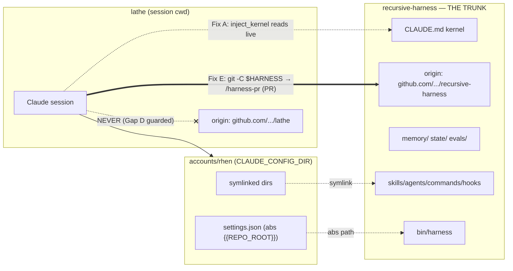

# Spec — Harness portability into foreign projects  (v2, post-review)

- **Status:** DRAFT / reviewed / for approval. Nothing built yet.
- **Date:** 2026-06-18
- **Prediction:** `95dc8b48` → **scored MISS** (v1 predicted a clean audit; it wasn't — see Review log).
- **Reviews:** harness-auditor = APPROVE-WITH-CHANGES; technical critic = SOUND-WITH-FIXES. All
  must-fixes are folded into this v2. Dry-run evidence in §8.1.
- **Lathe-rooted test (§8.2): DONE** — Gaps A/B/D confirmed live; Fix D dropped. **Final build set = A, B, E.**
- **Touches the enforcement layer** (`hooks/`, `templates/`) → ships via `/harness-pr` +
  `HUMAN_APPROVED` + `/run-evals`. (Fix E touches only `commands/`, which is **not** guard-locked.)

---

## 1. Problem

The harness brain already travels via the **fleet/silo model**: `account-init.sh` makes a
`CLAUDE_CONFIG_DIR` a complete, non-divergent *view* of the trunk — `agents/ commands/ hooks/ skills/`
are **symlinks** back to the repo, `settings.json` wires hooks by **absolute `{{REPO_ROOT}}` path**,
and `bin/harness` self-roots via `dirname(dirname(__file__))`. So the procedure layer, CLI, and ledger
reach the trunk **by reference, never by copy** — ONE TRUNK holds by construction.

Four things misbehave when the session cwd is a **foreign project** (e.g. `lathe`). Three are defects;
one is a deliberate-decision question.

## 2. Current state (verified against code + a dry-run, 2026-06-18)

| Component | Travels via | Foreign cwd OK? |
|---|---|---|
| skills / agents / commands / hooks | symlinks (`account-init.sh` L94–97) | ✅ |
| `bin/harness` | absolute path; `ROOT = dirname(dirname(abspath(__file__)))` | ✅ (dry-run T-d) |
| `memory/ state/ evals/` | absolute path from hooks/CLI | ✅ single-sourced |
| guard_enforcement_layer | protects trunk paths by absolute path | ✅ from anywhere |
| **`CLAUDE.md` kernel** | loads as project memory **only at the trunk** | ❌ **absent in foreign cwd** |
| **Guard B** (`guard_worktree_session.py`) | resolves repo from cwd; `_save_map` writes `<repo>/state/…` | ❌ **writes `state/` into the foreign repo** |
| **PR-routing** (`/retro`, `/harness-pr`) | resolves `$HARNESS` + `cd "$HARNESS"`; bare `git push`/`checkout` after | ⚠️ **fragile** — see Gap D |
| banner + retro/cadence gates | anchored to `HARNESS_ROOT/state` | ⚠️ nag, but no pollution (§5.3) |

## 3. The gaps (verified)

**Gap A — kernel absence (core blocker).** The 6 prime directives load as project memory only when
`cwd == trunk`. In `lathe`, they are **silently inactive**. This is what makes "take my harness with
me" feel impossible.

**Gap B — Guard B pollutes foreign repos.** `_resolve(cwd)` walks to the foreign repo root and
`_save_map()` does `os.makedirs(<foreign-repo>/state)` + writes `session_owners.json` there (verified
by executing `_claim`+`_save_map` against a temp repo — critic). Surfaces as an untracked `lathe/state/`.

**Gap C — banner/nudge noise (decision, not a defect).** Banner prints unconditionally; retro/cadence
gates can block Stop in a foreign project. These write only to `HARNESS_ROOT/state` (no pollution) and
the flows work from any cwd. Behavior choice — §5.3.

**Gap D — PR-routing fragility (your catch; confirmed live).** `/retro` and `/harness-pr` already
resolve `$HARNESS` install-agnostically and `cd "$HARNESS"` (they are **not** cwd==trunk-assuming — v1
was wrong about that). But later git steps (`git push`, `git checkout main`, `gh pr create`) rely on
that `cd` **persisting**, which it does **not** across separate Bash calls — and a foreign-rooted
session snaps cwd back to the foreign project. Dry-run **T-e confirms `lathe` has its own live remote**
(`github.com/GhostlyGawd/lathe.git`), so a misrouted git step would branch/push/checkout the **wrong
repo**. Not the unsolvable client-cwd-boundary issue — it's our own command text, fully in our control.

## 4. Goals / non-goals

**Goals.** G1 prime directives active in any foreign project, sourced live from the trunk (no copy).
G2 the harness never writes into a foreign repo's tree. G3 zero behavior change inside the trunk + its
worktrees. G4 learning-routing (`/retro`→`/harness-pr`) provably targets the **trunk** repo from any
cwd, never the foreign one.

**Non-goals.** N1 plugin (rejected — §11). N2 Guard B protecting *foreign* repos' worktrees (out of
remit). N3 changing the learning-routing *logic* (only its repo-targeting robustness — Fix E).

## 5. Design

### Shared predicate (Fixes A + B)
Both key off the same **worktree-aware, path-only** test (mirrors Guard B's existing `_resolve`, which
the critic verified strips `.claude/worktrees/<name>` back to the trunk):

```
harness_repo(cwd) == HARNESS_ROOT      # no git call; pure path logic
```

True for the trunk **and any harness worktree**; false for every foreign repo. **It must be path-based,
not `git rev-parse --show-toplevel`** — the git toplevel of a harness worktree ≠ HARNESS_ROOT, so a git
check would double-load the kernel inside worktrees (critic verified; this is the bug `session_start.py`'s
own `_branch_warning` would have if copied — do not inherit it).

### 5.1 Fix A — kernel-injection SessionStart hook  *(new `hooks/inject_kernel.py`)*  — enforcement
- **Trigger:** `SessionStart`, matcher **`startup|resume|clear|compact`** in `templates/account-settings.json`.
  `compact` is included: after a context compaction in a foreign repo the injected context may be
  evicted, and the matcher must re-inject (critic MED — the guard's own docstring treats `compact` as a
  real SessionStart source).
- **Logic:**
  1. Read `cwd` from the payload. If missing/unparseable → **emit nothing, exit 0** (never default-inject:
     a default-on-unknown would double-load inside the trunk — auditor F5 + critic).
  2. If `harness_repo(cwd) == HARNESS_ROOT` → emit nothing (CLAUDE.md already loads here).
  3. Else → read the trunk's `CLAUDE.md`, extract **the `## Prime directives` + `## Cadence` sections
     only** (Q1 resolved — the full file ships ~770 tokens incl. the trunk-internal "Where things live"
     block, misleading from a foreign cwd — critic), and print to stdout prefixed
     `[harness kernel — active in foreign project; source: <trunk>/CLAUDE.md]`.
  4. **cp1252 safety (critic HIGH-1):** `CLAUDE.md` contains `→` (U+2192), which crashes `print()` on the
     Windows cp1252 console (`session_start.py:60-61` documents this exact hazard). The hook MUST
     `sys.stdout.reconfigure(encoding="utf-8", errors="replace")` before printing.
  5. **Fail open over the WHOLE body** (read, parse, AND emit): any error → emit nothing, exit 0. v1's
     fail-open only covered the read phase; a crash in emit still exits 1.
- **Source of truth:** read live from the trunk each session — never cached, so ONE TRUNK holds and the
  kernel can't drift (auditor F4 verified: no existing hook reads CLAUDE.md, so this is not duplication).
- **Not a self-grant** (auditor F3 verified): injecting the kernel adds *obligations*, not authority; it
  cannot create the `HUMAN_APPROVED` marker, so it can't unlock the enforcement guard.

### 5.2 Fix B — scope Guard B to the harness tree  *(edit `hooks/guard_worktree_session.py`)*  — enforcement
- **Add the constant** (critic HIGH-2 — it does **not** exist in this file today; the snippet in v1
  referenced a name from `session_start.py` and would `NameError` → be swallowed by `except: return 0`
  → silently disable Guard B *everywhere*):
  `HARNESS_ROOT = os.path.dirname(os.path.dirname(os.path.abspath(__file__)))` at module top.
- **Early-return** right after `tree, repo = _resolve(cwd)` (`:477`):
  `if os.path.normcase(repo) != os.path.normcase(HARNESS_ROOT): return 0`.
- **Effect:** no-ops in every foreign repo (never writes `state/` there); trunk + harness worktrees
  unchanged (auditor F1 verified `_resolve` returns `repo == HARNESS_ROOT` for both, and the early-return
  sits before the SessionEnd/SessionStart/PreToolUse branches, preserving fail-open + claim logic).
- **Framing:** scope-*narrowing to remove an out-of-scope side effect*, **not** enforcement-weakening —
  the one-session-per-tree protection across the trunk + its worktrees is byte-for-byte preserved.
- **Test-suite rework (auditor F2 — HIGH, the biggest build risk):** `tests/test_guard_worktree_session.py`
  feeds `tempfile.mkdtemp` cwds; with the early-return, every block/warn test would `repo != HARNESS_ROOT`
  → return 0 → **silently fail**. The build MUST rework the fixtures to exercise the scope check at the
  **real HARNESS_ROOT** (e.g. construct the synthetic tree under HARNESS_ROOT, or unit-test in-process
  monkeypatching the module constant) — **not** by gutting the suite to pass (that would be the actual
  reward-hacking outcome). No `HARNESS_ROOT` env override (that's the self-assertable-bypass anti-pattern
  already documented at `_TTL_SECONDS`).

### 5.3 Fix C — banner/nudge in foreign projects  *(decision; minimal change)*
Keep retro/cadence gates active everywhere (ONE TRUNK — `lathe` learnings should still flow back); keep
the `[harness] calibration …` banner (useful "harness is loaded here" signal). Q2: leave the full
banner (low harm). No code change.

### 5.4 Fix D — additionalDirectories  *(DROPPED — §8.2 test resolved Q3)*
- **Dropped.** The lathe-rooted test (§8.2) confirmed the **Read AND Edit tools already reach trunk
  files** from a foreign-rooted session under `permissions.defaultMode: "bypassPermissions"` — no
  boundary block, no `/add-dir` needed. With dry-run T-d (`bin/harness` runs by absolute path),
  `additionalDirectories` adds nothing (auditor F6 / critic were right it was redundant). Removed
  entirely — which also avoids the `HUMAN_APPROVED` the `templates/` edit would have needed (`templates/`
  IS guard-locked: `guard_enforcement_layer.py:24`, correcting v1).

### 5.5 Fix E — PR-routing hardening  *(edit `commands/*.md` — NOT guard-locked)*  — your catch
- **What:** make every git/gh/file step in the learning-routing commands **trunk-explicit**, so they
  cannot misroute to a foreign repo's live remote (Gap D). Two validated mechanisms (dry-run T-b, T-c):
  `cd "$HARNESS" && <git…>` in a **single** invocation, **or** `git -C "$HARNESS" …`. PR creation:
  `gh pr create -R <harness-repo>` (or run inside `$HARNESS`). The existing `$HARNESS` resolution + bare
  `bin/harness` absolute calls already work (T-a, T-d) — only the **git steps** rely on a non-persistent
  `cd` and must be hardened.
- **Files (5 trunk-routing commands):** `commands/{harness-pr,retro,calibrate,gc,meta-retro}.md`.
  **`standup.md` is EXCLUDED** (corrects v2's list): standup is project-scoped — it operates on "the
  current repo" (which may be a foreign project) and its branch-prune sweep SHOULD target that repo,
  not the trunk; forcing it trunk-ward would be wrong. (Its `bin/harness` health reads are already
  `$HARNESS`-absolute.) `commands/` is **not** in the guard's PROTECTED tuple, so Fix E ships without
  `HUMAN_APPROVED`, but is still reviewed (ONE TRUNK).

## 6. Diagrams

### 6.1 Topology — reference, not copy (PR goes to the TRUNK's remote, never lathe's)



### 6.2 ASCII quick-look

```
            ┌──────────────── THE TRUNK (origin: …/recursive-harness) ───────────────┐
            │ CLAUDE.md(kernel)  skills/agents/commands/hooks  memory/ state/ evals/  │
            │ bin/harness(self-roots)                                                 │
            └──▲────────────▲────────────▲─────────────────────────▲─────────────────┘
   symlinks ──┘  abs-path ──┘  inject ───┘   Fix E: git -C $HARNESS ┘  (PR → TRUNK remote)
        │            │            │                       │
   ┌────┴── accounts/rhen (CLAUDE_CONFIG_DIR) ──┐         │
   └───────────────────▲─────────────────────────┘       │
                        │ CLAUDE_CONFIG_DIR               │
                 ┌──────┴──── lathe (cwd, origin: …/lathe) ────┐
                 │ kernel INJECTED ✓  no state/ here ✓         │
                 │ git steps target $HARNESS, NOT lathe ✓ (E)  │
                 └─────────────────────────────────────────────┘
```

## 7. Prime-directive compliance
- **D1 predict:** `95dc8b48` logged, scored MISS; a new prediction will be logged before build.
- **D2 route:** this *is* routed (rule→hook; workflow-text→command).
- **D5 enforcement:** Fixes A/B/D in `hooks/`+`templates/` → `/harness-pr` + `HUMAN_APPROVED` +
  `/run-evals` + harness-auditor on the diff. Fix E (`commands/`) → normal reviewed PR.
- **D6 ONE TRUNK:** kernel injected live from the trunk (no copy); Guard B scoping keeps the trunk
  guarded; **Fix E guarantees PRs land on the trunk's remote, not the foreign repo's** (Gap D closed).

## 8. Verification

### 8.1 Dry-run already run (this session, from the lathe worktree cwd)
- **T-a** `$HARNESS` resolves to the trunk from a foreign cwd via the config-dir hooks symlink. ✅
- **T-b** `cd "$HARNESS" && git …` (one call) → trunk/`main`. ✅
- **T-c** `git -C "$HARNESS" …` → trunk/`main`. ✅
- **T-d** `"$HARNESS/bin/harness" stats` → works (so Fix D not needed for CLI). ✅
- **T-e** `lathe` has its own live remote → misroute is real ⇒ Fix E justified. ✅
- **Limit:** this session is trunk-rooted, so the snap-back-to-*lathe* and the Read/Edit-tool boundary
  could NOT be reproduced here — see §8.2.

### 8.2 The definitive test — DONE (real lathe-rooted session, 2026-06-18)
Ran from a session rooted in `lathe-worktrees/exploration-01` with `CLAUDE_CONFIG_DIR` = the rhen account
silo. Results:
- **Gap A — CONFIRMED.** Kernel absent: the lathe session's active project instructions held the harness
  scaffolding (banner, skills, deferred-tools) but **no `## Prime directives` block** — it could not quote
  directive 1. ⇒ Fix A needed.
- **Gap D — CONFIRMED.** cwd toplevel = `D:/GitHub Projects/lathe`; a separate-step
  `git checkout -b probe-portability-2026-06-18` branched **off lathe's 810ff0a**, with
  `origin = github.com/GhostlyGawd/lathe.git`; cwd stayed at lathe across all three separate calls ⇒ bare
  git steps in a routing command DO hit the foreign repo. ⇒ Fix E needed.
- **Fix D — NOT needed.** The **Read and Edit tools both reached the trunk file** from the lathe session
  (boundary not enforced under bypassPermissions). ⇒ Fix D dropped, Q3 closed.
- **Gap B — CONFIRMED.** An untracked `state/session_owners.json` (Guard B's ownership map) appeared in
  the lathe worktree. ⇒ Fix B needed.
All probe artifacts (branch, trunk edit, lathe `state/`) were reverted; spec integrity re-verified afterward.

### 8.3 Eval scenarios for `/run-evals` (before merge)
- T1 cwd=trunk → inject_kernel emits nothing. T2 cwd=harness **worktree** → emits nothing (path predicate,
  not git). T3 cwd=foreign → emits prime directives + cadence. **T3b cwd=foreign, stdout is cp1252 →
  no UnicodeEncodeError** (critic HIGH-1). **T3c source=`compact` in foreign → re-injects.** T4 cwd=foreign
  → Guard B returns 0, **no `state/` created**. **T5 cwd=trunk/worktree → Guard B early-return runs without
  NameError and still blocks a 2nd session** (critic HIGH-2; via the reworked fixtures, not the gutted suite).
  T6 malformed/missing cwd → both hooks exit 0, **inject defaults to NO-emit**. T7 Windows path normalization
  on the `repo == HARNESS_ROOT` compare. **T8 (Fix E) — git step via `git -C`/one-call cd lands on the trunk
  remote from a foreign cwd** (mechanics; full end-to-end is §8.2).

## 9. Rollback
Revert the PR: delete `inject_kernel.py` + its settings wire; revert the Guard B constant + early-return
and restore the original test fixtures; revert the `commands/*` git-targeting. No data migration;
`state/` untouched.

## 10. Decisions
- **Q1 — resolved:** inject **prime directives + cadence only** (token cost + trunk-internal block).
- **Q2 — resolved:** keep the full banner in foreign projects (low harm).
- **Q3 — resolved:** Fix D dropped — the §8.2 test showed the Edit/Read tools already reach the trunk,
  so no `additionalDirectories` is needed.

## 11. Out of scope — plugin
Rejected for own-machine use: a plugin can't carry the calibration log/ledger, evolving `memory/`+`evals/`,
settings/autonomy, or the kernel, and would re-deliver the procedure layer as a lagging cache copy of dirs
`account-init.sh` already symlinks — a brain-fork ONE TRUNK forbids. Pocket it only for publishing the
stateless layer to *other people* who never clone the trunk.

---

## Review log (v1 → v2)
- **Prediction `95dc8b48` = MISS.** v1 predicted "audit clean, minor nits"; reality: 2 HIGH must-fixes +
  a redundant fix + a missing fix (Gap D, user-found). Auditor flagged the prediction as reward-shaped.
- **harness-auditor (APPROVE-WITH-CHANGES):** F1 Fix B is scope-narrowing not weakening (PASS, verified);
  F2 Fix B breaks the Guard B test suite (HIGH → §5.2); F3/F4 kernel injection not a self-grant / not a
  fork (PASS); F5 fail-open unverified, add no-default-inject (→ §5.1); F6 Fix D redundant under
  bypassPermissions (→ §5.4); F7 `templates/` IS guard-locked (→ §5.4).
- **technical critic (SOUND-WITH-FIXES):** HIGH-1 cp1252 stdout crash (→ §5.1.4); HIGH-2 `HARNESS_ROOT`
  absent in the guard file → NameError → silent disable (→ §5.2); MED predicate must be path-based +
  matcher must include `compact` (→ §5/§5.1); both gaps independently reproduced.
- **dry-run (§8.1):** resolution + both git-targeting mechanisms validated; `lathe` remote confirmed
  (Gap D real); Fix D narrowed/gated.
- **lathe-rooted test (§8.2, 2026-06-18):** Gap A (kernel absent), Gap B (`state/` in lathe), and Gap D
  (branch landed on lathe's remote) all confirmed live; Read/Edit reach the trunk ⇒ **Fix D dropped**.
  **Final build set: A, B, E.**
