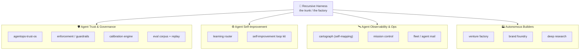
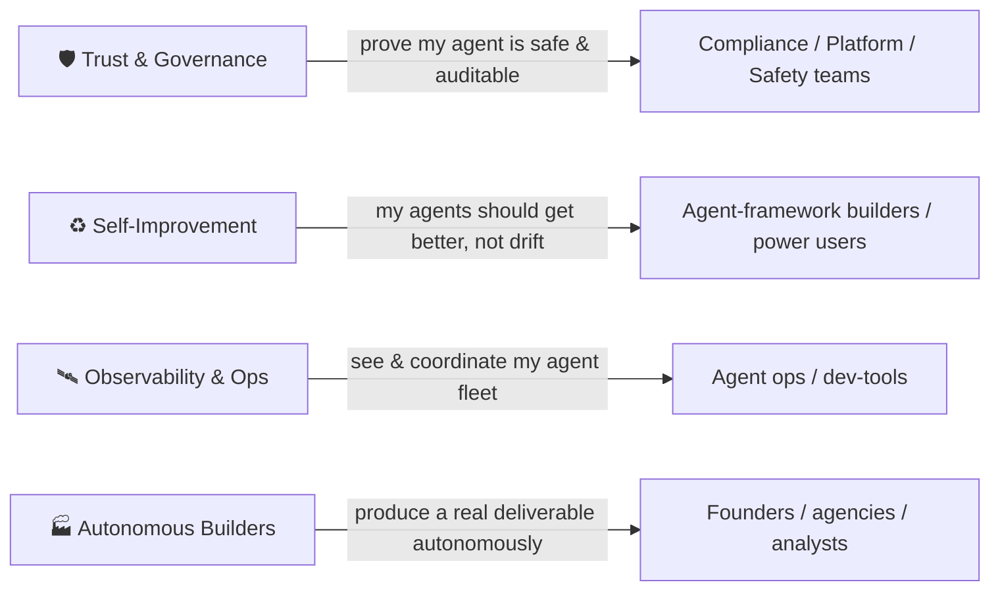
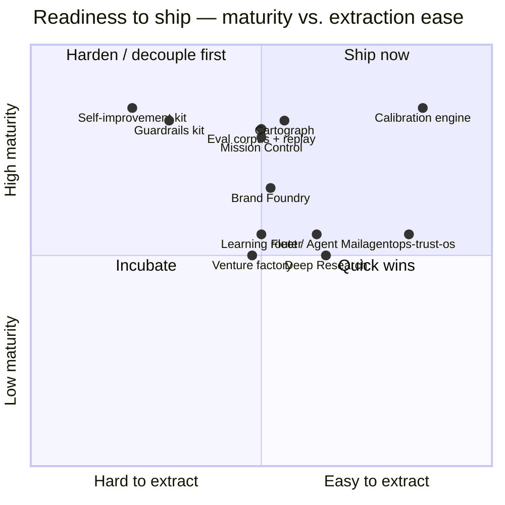
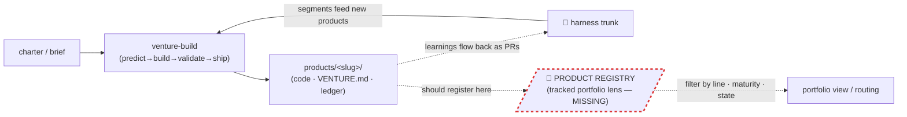

# Proposal: The Productization Map + the missing Product System

- **Date:** 2026-06-28
- **Status:** DRAFT — strategic map + system design for review. No code/enforcement
  changes yet; this is the slice-and-visualize artifact requested ("slice the repo
  into productizable segments, map value/features in multiple ways visually") plus a
  design for the "product system / harness segmentation system" the same request asks for.
- **Origin:** user productization brief, 2026-06-28. Prediction `c944f4ad` logged at start.

---

## 0. What already exists (so we extend, not duplicate)

The "factory" is **already half-built** — this proposal names the missing half.

| Asset | What it does | Gap it leaves |
|---|---|---|
| `skills/venture-build` + `/venture` | Turns a charter into a *validated, ledgered* venture (predict→scaffold→build→validate→review→ship). | Builds **one** product at a time. No catalog, no cross-product view. |
| `products/` (gitignored; each venture its own repo/dir per ADR-0005) | Where products live. | Scratch space. **Untracked, unindexed, unsegmented** — invisible to the one trunk. |
| `products/agentops-trust-os/` | One PoC product (agent observability/compliance/incident/policy/cost SDK). | Untracked; not registered anywhere; its value isn't mapped. |
| `cartograph/ATLAS.md` | Maps the harness as **infrastructure** (6 layers, lifecycle, state, blast radius). | Maps *plumbing*, not *product value*. No "what could we sell / spin out" lens. |
| `bin/harness map` | Auto-syncs the infra atlas. | No equivalent for a **product portfolio**. |

**The one-sentence gap:** there is no **product lens** on the harness and no **tracked
registry/segmentation** for what the factory produces. The ATLAS sees plumbing; nothing
sees value. This proposal adds that lens (the map below) and the system to keep it synced.

---

## 1. The slice — harness → productizable segments

Each segment is a value-bearing unit that could stand alone as a product or OSS tool.
Maturity = how shippable today. Extraction = how hard to carve out of the harness.

| # | Segment | Product framing | Buyer / user | Maturity | Extraction |
|---|---|---|---|---|---|
| 1 | **Calibration engine** (`bin/harness` predict→score→Brier) | "Verified self-awareness for agents" — a calibration ledger + overconfidence detector | AI eval / agent-quality teams | High | **Easy** (small CLI + JSONL) |
| 2 | **Cartograph** (graph extract → multi-lens atlas → drift gate → connectivity linter) | "Living architecture atlas + dead-code linter for any codebase/agent system" | Dev-tools, architecture governance | High | Medium |
| 3 | **Eval corpus + in-session replay** (ADR-0003: no headless, subscription auth) | "Regression CI for prompts/agents — no API key, runs on your subscription" | Prompt/agent CI | High | Medium |
| 4 | **Enforcement / guardrails** (write-lock guard, worktree/trunk leases, autonomy graduation) | "Governance kit for self-modifying agents — reward-hack & blast-radius guards" | Agent safety / platform teams | High | Medium-Hard (CC-coupled) |
| 5 | **Mission Control** (read-only TUI control room over state + fleet) | "Fleet control room / observability TUI for agent ops" | Agent ops | High | Medium |
| 6 | **Fleet / Agent Mail** (append-only typed coordination bus) | "Lateral coordination bus for multi-session / multi-agent work" | Multi-agent infra | Medium | Easy-Medium |
| 7 | **Learning router** (`routing-learnings`: signal → hook/skill/command/agent) | "Anti-auto-memory router — compiles agent experience into versioned artifacts" | Agent framework builders | Medium | Medium |
| 8 | **Self-improvement loop kit** (retro / meta-retro / corrections / auditor / autonomy) | "Self-improving harness framework for Claude Code" | Power users / teams on CC | High | Hard (is the trunk) |
| 9 | **agentops-trust-os** *(already extracted)* | "AgentOps Trust OS — SOC2-style evidence, incidents, policy, cost over agent runs" | Compliance / AgentOps | PoC | Done |
| 10 | **Venture factory** (`venture-build` + workflows) | "Autonomous MVP/venture factory from a charter" | Founders / agencies | Medium | Medium |
| 11 | **Brand Foundry** (`brand-foundry` + `huashu-design`) | "Code-packaged brand identity generator" | Design / branding | Medium-High | Medium |
| 12 | **Deep Research** (`deep-research`: fan-out → verify → cited report) | "Adversarially-verified deep-research agent" | Research / analysts | Medium | Easy-Medium |

---

## 2. Four product lines  `[curated overlay]`

The 12 segments cluster into four coherent lines — four ways to take the harness to market.

---

## 3. Lens — value → buyer

Who pays, and for what job-to-be-done.

---

## 4. Lens — readiness to ship (the filter)

Where to spend first. Top-right = extract now; top-left = harden/decouple first;
bottom = incubate. This is the prioritization filter the request asks for.

---

## 5. The factory flow — and where the missing piece sits

How a product gets made today, and the **one node that's missing** (dashed red).

---

## 6. The Product System (the design)

The missing half. Mirror what the cartograph already does for infrastructure, but for
**product value** — and make the portfolio part of the one trunk.

**6.1 A tracked registry.** `products/REGISTRY.md` — the product-lens index, analogous
to `ATLAS.md`. One row per product: slug · line · value prop · segment(s) it extracts ·
maturity · extraction status · branch/repo · links. Auto-syncable.

**6.2 Segmentation via per-product front-matter.** Each `products/<slug>/VENTURE.md`
(venture-build *already writes this*) gains a small structured header: `line`, `segments`,
`maturity`, `status`. The registry aggregates these — no new authoring burden.

**6.3 Tracking model.** Keep product **code** gitignored (each its own repo, ADR-0005),
but **track** `REGISTRY.md` + the thin `VENTURE.md` stubs, so the portfolio lives in the
one trunk while the code stays decoupled. (Surgical `.gitignore` un-ignore.)

**6.4 Auto-sync.** A generator (`bin/harness products` or `products/registry.py`) walks
`products/*/VENTURE.md`, rebuilds `REGISTRY.md`, and a `--check` flag flags drift — the
exact pattern `cartograph/atlas.py --check` already proves works.

**6.5 State routing.** Each product's predictions/corrections/evals already flow through
`bin/harness`; the registry just adds a per-product **view/filter** over that existing
state — no parallel store (honors ADR-0001: one memory).

> This **extends** venture-build (which *builds*) and the cartograph pattern (which
> *maps + gates*). It introduces **no enforcement artifact** and touches no write-locked
> path — it's an observability/PM lens, so it ships via normal PR, not `/harness-pr`.

---

## 7. Open decisions (for the human)

1. **Tracking model** — track `REGISTRY.md` + `VENTURE.md` stubs while keeping code
   ignored (recommended), or keep the whole portfolio out of the trunk?
2. **Auto-sync surface** — a `bin/harness products` subcommand (consistent with `map`),
   or a standalone `products/registry.py`?
3. **Scope of the map** — internal architecture/strategy only (this doc), or also add
   market-sizing / revenue framing per line (turns it into a GTM portfolio)?

---

## Provenance

2026-06-28 — productization brief. Slices the harness (per `cartograph/ATLAS.md` §1–7
machine-truth) into 12 segments / 4 product lines; designs the missing tracked product
registry as an extension of `skills/venture-build` + the `cartograph/atlas.py --check`
sync pattern. Prediction `c944f4ad`. No enforcement-layer edits.
