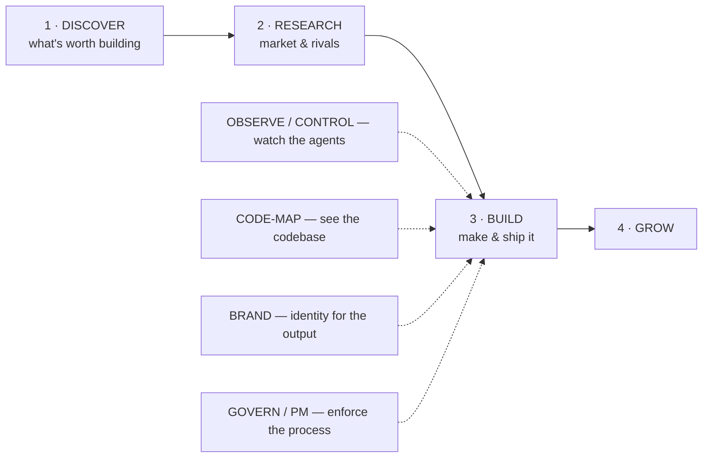
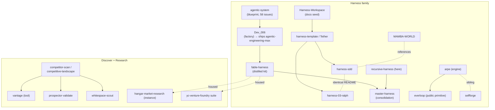

> **Current:** `approved` decision · `landed` implementation

## Status history

| Date | Decision | Implementation | Evidence |
| --- | --- | --- | --- |
| 2026-07-17 | approved | landed | review completed in this record |
<!-- proposal-history:end -->

## Historical record

# Portfolio Landscape — Factual Review

- **Date:** 2026-06-28
- **Status:** REVIEW ONLY. This maps what exists across the GhostlyGawd repo ecosystem
  and where functions overlap — **factually**. No keep / merge / kill calls, no action
  items. Those are a deliberately separate, later pass.
- **Method:** `gh repo view` + `gh api .../contents` over ~40 repos via 6 parallel readers
  (no clones). Plus the two internal tools that live inside *this* repo (`cartograph`,
  `mission_control`). Prediction `5d784781`.

---

## 0. Headline (factual)

You have independently built **every stage of a venture funnel — and most of the
cross-cutting infrastructure — multiple times.** The funnel is *complete*; it is just
spread across ~40 repos with clear, traceable genealogies and heavy function overlap.

The one recurring idea — *"an agent that autonomously builds software under governance,
over durable on-disk state"* — appears in **~14 repos** at different stages of distillation.

---

## 1. The value chain everything sits on

Every ecosystem repo occupies one (or more) of these stages. This is the spine.

---

## 2. Cluster inventory (factual)

### A. Harness / autonomous-build engines — **~14 repos** (the big cluster)

The same thesis, distilled over and over. Sub-grouped by what they actually are:

| Sub-family | Repos | One-line (factual) |
|---|---|---|
| **Self-improving meta-loop** | `recursive-harness` *(here)*, `selfforge`, `arpe` | Fresh-context cycles / predict→route→retro; disk-as-memory; anti-reward-hacking; "the repo is the learnable layer." selfforge & arpe are siblings (Python vs Shell), both north-starred to "10k GitHub stars / 30 days." |
| **Extracted primitive** | `everloop` *(public)* | The bare bounded-tick loop, stripped of governance — **arpe built and shipped it** (tick 1→5). |
| **Build-delivery factory** | `Dev_006`, `fable-harness`, `master-harness`, *(skill)* `venture-build` | idea/charter → plan → spec → build → review → live-accept. `Dev_006` ships the public `agentic-engineering-max` plugin. |
| **SDD spec-gate harness** | `harness-sdd`, `harness-03-ralph`, `MAMBA-WORLD` | Spec-first; a git pre-commit gate blocks code/spec drift. `harness-03-ralph` carries a **byte-identical README** to `harness-sdd`. |
| **Scaffold / template** | `harness-template` ("Tether"), `Harness-Workspace` | Docs + operating rules + a "ratchet" failure→fix loop; pre-enforcement seeds of the family. |
| **Blueprint / design corpus** | `agentic-system`, `lathe` | `agentic-system` = the Notion+Linear blueprint (58 issues) that `Dev_006` implements; `lathe` = a design-stage "Agentic Dev Environment" (brand only, no code yet). |

### B. Discover — what to build  (**~3–4**)
| Repo | Factual |
|---|---|
| `prospector` | Venture discovery→validation→`GOAL.md`; "upstream front-end for venture-build"; validate stage = adversarial novelty refutation. |
| `whitespace-scout-marketplace` | Marketplace-packaged greenfield-opportunity discovery (brainstorm→web-validate→kill-dupes→synthesize). |
| `yc-foundry-experiment` | Test-bed for the `yc-venture-foundry` suite (YC-style venture-formation OS); suite copied from `fable-harness`. |

### C. Research — market & rivals  (**1 tool + 1 instance**)
| Repo | Factual |
|---|---|
| `vantage` | The **tool**: a repeatable 10-report competitive + market-research suite (landscape, TAM, monetization, GTM). Wraps a `competitor-scan` skill. |
| `hangar-market-research` | An **output instance** of that kind of suite (12 reports on "Hangar"). Its `STATE.md` says it was extracted 2026-06-24 from a `competitive-landscape` effort that lived in `fable-harness`/`master-harness`. |

### D. Code-map — see the codebase  (**2**)
| Repo | Factual |
|---|---|
| `cartograph` *(internal, here)* | Codebase→graph→**static multi-lens Mermaid atlas** + drift gate / connectivity linter. |
| `codeweb` *(public)* | Codebase→**symbol-level** call/import graph→**interactive HTML** map + 20 deterministic **MCP query tools** for agents + a pre-registered measurement paper. |

### E. Observe / control — watch the agent fleet  (**~5**)
| Repo | Factual |
|---|---|
| `mission_control` *(internal, here)* | Read-only **TUI** control room over harness state + live fleet feed. |
| `grove` *(public, v1.0.0)* | Cross-platform OSS **GUI cockpit**: parallel CLI agents in isolated worktrees, multi-vendor adapters, terminal+diff, phone PWA. |
| `hangar` | Windows-native, Claude-only cockpit; headline = **Run-N arena** (race one task across N accounts); zero-token observability. |
| `symphony-clone` | Board-watching orchestration engine: every ticket gets an isolated workspace + a Claude agent, run in parallel. |
| *(also)* `Dev_006`→claude-manager (control-room dashboard); `lathe` (design-stage "signal lanes") | Same "one console over a fleet" surface. |

### F. Brand — identity for the output  (**3**)
| Repo | Factual |
|---|---|
| `brand-foundry` *(repo = the skill here)* | Divergence→react **growth** pipeline; "named styles BANNED"; locks to `LANGUAGE.md` + tokens → `dist/`. |
| `brand-studio` | A "**firm of agents**" (strategist/designer/copywriter/critic) → brand suite + machine-readable `brand.json`. |
| `viewforge` | YouTube channel **factory** — **consumes `brand-studio`** for its brand-suite department. |

### G. Govern / PM — enforce the process  (**~4**)
| Repo | Factual |
|---|---|
| `engineering-board` | Markdown board → autonomous multi-agent build state machine (Stop-hook-driven finding capture → tdd→review→validate). |
| `commit-gate` | Hook-driven conventional-commit enforcement + `Refs:` issue trailer. |
| `Product-Team` | "Productization Expert" plugin: idea/prototype → saleable packaging (PRD, business plan, pricing, positioning) via `/pe-*` phases. **(directly relevant to your original "productize" ask.)** |
| `agentic-system` | Notion+Linear blueprint + rendered system maps for the autonomous-dev + PM system. |

### H. Downstream products / sandboxes — *(out of overlap scope; what the factory builds or side-projects)*
`Tycoon` (Phaser game) · `PPC-Bot` (agentic ad SaaS) · `sales-forecasting-tool` · `MOCKAZON` (Amazon listing preview) · `canopy-landing` · `Beat-Storefront-Test` (synth storefront) · `aem-smoke` (smoke-test build target) · `EB-Test` (engineering-board sandbox) · `symphony-demo-walkthrough` (training).

---

## 3. Genealogy — who descended from / built what  (factual, from READMEs + STATE docs)

Key threads:
- **Harness-Workspace → harness-template → harness-sdd/-03-ralph** (the scaffold→SDD line).
- **agentic-system → Dev_006 → fable-harness → master-harness** (blueprint → factory → kit → consolidation), with `recursive-harness` as master's other parent.
- **arpe → everloop**, with **selfforge** a parallel sibling of arpe.
- **competitor-scan** is the shared root of `vantage`, `prospector`'s validate stage, and `whitespace-scout`; `hangar-market-research` + the `yc-venture-foundry` suite both trace back through `fable-harness`.

---

## 4. Duplication summary (counts only — no judgment)

| Function | # implementations | Repos |
|---|---:|---|
| Autonomous-build / self-improving harness | **~14** | recursive-harness, selfforge, arpe, everloop, master-harness, fable-harness, Dev_006, harness-sdd, harness-03-ralph, harness-template, Harness-Workspace, agentic-system, MAMBA-WORLD, lathe |
| Agent cockpit / mission control | **~5** | mission_control, grove, hangar, symphony-clone, (Dev_006 claude-manager) |
| Discovery / validation | **~4** | prospector, whitespace-scout, yc-venture-foundry, (Product-Team) |
| Brand generator | **3** | brand-foundry (repo+skill), brand-studio, (viewforge consumes) |
| Governance / PM board | **~4** | engineering-board, commit-gate, Product-Team, agentic-system |
| Code map | **2** | cartograph, codeweb |
| Market research | **2** | vantage (tool), hangar-market-research (instance) |

---

## 5. Factual observations (still review-only)

1. **The funnel is already whole.** discover (`prospector`/`whitespace-scout`) → research (`vantage`) → build (`venture-build`/`Dev_006`/`fable`) → grow, plus observe (`grove`/`hangar`/`mission_control`), code-map (`cartograph`/`codeweb`), brand (`brand-foundry`/`brand-studio`), govern (`engineering-board`). Nothing in the funnel is *missing*; pieces are *duplicated and scattered*.
2. **Heavy genealogical duplication, not random.** Most overlaps are versions/distillations of one ancestor (identical READMEs, "distilled from", "extracted from", "sibling of"). This is iteration history fossilized as separate repos.
3. **Internal-vs-external twins.** Two functions exist both *inside this harness* and *as standalone repos*: code-map (`cartograph` vs `codeweb`) and control room (`mission_control` vs `grove`/`hangar`). Same for brand (skill vs `brand-foundry`/`brand-studio` repos).
4. **Maturity is uneven.** Public + versioned: `everloop` (0.1), `grove` (1.0), `codeweb` (0.2), `agentic-engineering-max` (via Dev_006). Active this week: `codeweb`, `hangar-market-research`. Design-only: `lathe`, `harness-template`, `Harness-Workspace`. Test/sandbox: `EB-Test`, `aem-smoke`, `yc-foundry-experiment`.
5. **`Product-Team` already targets your original question** — it's a plugin for turning a prototype into saleable packaging. Worth knowing it exists before building any "productization" tooling.

---

## Provenance

2026-06-28 — factual landscape pass requested ("map the overlapping landscape factually,
this pass is review only"). 6-reader parallel fan-out over ~40 GhostlyGawd repos via `gh`,
plus `cartograph`/`mission_control` (internal). Descriptive only; keep/merge/kill deferred
to a later pass by explicit instruction. Prediction `5d784781`.
